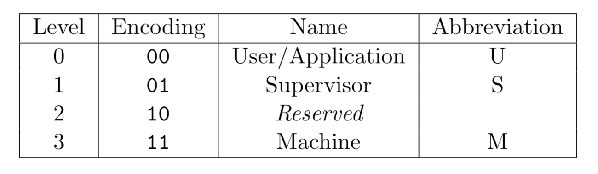
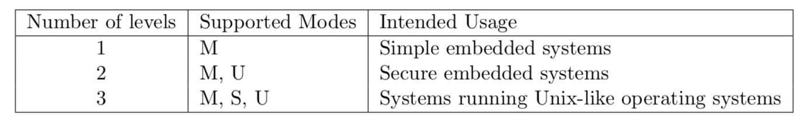

2、特权模式
-----------

2.1、特权模式分类
~~~~~~~~~~~~~~~~~

RISC-V定义了三种特权模式，分别为 Machine Mode（M Mode），Supervisor
Mode（S Mode），User Mode（U Mode）。

   mode

1. Machine Mode：简称 M 态，用于管理安全执行环境，最高权限。
2. Supervisor Mode：简称 S 态，通常运行操作系统。
3. User Mode：简称 U 态，通常运行应用程序。

在特权级架构实现中，M Mode 为必选模式，另外两种为可选模式。

特权模式通过不同的模式组合可以实现不同用途的系统： |usage|

1. M Mode：通常为简单的嵌入式系统
2. M Mode + U
   Mode：该系统可以实现用户和机器模式的区分，从而实现资源的保护
3. M Mode + U Mode + U Mode：该系统可以实现类Unix操作系统

2.2、Debug mode
~~~~~~~~~~~~~~~

通常 RISC-V 实现包括一个 debug mode 来支持片外调试或者制造测试。

D-mode 可认为是一个额外的特权模式，它甚至比 M-mode 拥有更多访问能力。

调试模式会保留一些只能在 D-mode 访问的 CSR 寄存器。

