# 3、寄存器

## 3.1、通用寄存器
RISC-V 架构提供 1 个只读寄存器 x0 和 31 个用户可修改的通用寄存器 x1 到 x31。

| 寄存器 | ABI 名称 | 描述 | Saver |
| ------ | -------- | ------ | ------ |
| x0 | zero | 零值 | - |
| x1 | ra | 返回地址 | Caller |
| x2 | sp | 堆栈指针 | Callee |
| x3 | gp | 全局指针 | - |
| x4 | tp | 线程指针 | - |
| x5 | t0 | 临时/备用链接寄存器 | Caller |
| x6-x7 | t1-t2 | 临时寄存器 | Caller |
| x8 | s0/fp | 保存寄存器/帧指针 | Callee |
| x9 | s1/gp | 保存寄存器/全局指针 | Callee |
| x10-x11 | a0-a1 | 函数参数/返回值 | Caller |
| x12-x17 | a2-a7 | 函数参数 | Caller |
| x18-x27 | s2-s11 | 保存寄存器 | Callee |
| x28-x31 | t3-t6 | 临时寄存器 | Caller |

所有寄存器都可以作为通用寄存器使用。

其中 Caller 由调用者保存，Callee 由被调用者保存。Caller（调用者）指的是调用（或执行）一个函数的代码段或函数。它是主动发起函数调用的一方。Callee（被调用者）指的是被调用的函数本身。它是被动接受函数调用并执行相应操作的一方。

通用寄存器作用：
1. x0

    x0 寄存器又被称为 zero 寄存器，它的读写是无效的，读出来的值永远为 0 ，写入的值将会被丢弃。x0 寄存器的一个常见用途是帮助将其他寄存器初始化为零。

2. x1/ra：Return Address Register（返回地址寄存器）

    RISC-V 使用 x1 寄存器保存子程序的返回地址。

    当一个函数被调用时，ra 寄存器会被自动保存下来，以便在函数执行完毕后能够返回调用该函数的位置，通常为 pc + 4。

3. x2/sp：Stack Pointer Register（栈指针寄存器）

    RISC-V 使用 x2 寄存器被用作栈指针，并保存栈的基址，用于函数调用时的变量保存和程序现场保护等操作。栈基址必须对齐到 4 个字节，否则可能会出现加载/存储对齐错误。

    RISC-V 标准调用约定，栈是向下增长并且栈指针总是对齐到 16 字节（128位）。可在 [https://github.com/riscv-non-isa/riscv-elf-psabi-doc/blob/master/riscv-elf.adoc](https://github.com/riscv-non-isa/riscv-elf-psabi-doc/blob/master/riscv-elf.adoc) 查询更多详细信息。

4. x3/gp：Global Pointer Register（全局寄存器）

    RISC-V 使用 x3 寄存器存储全局指针。在 RISC-V 中，全局指针是一个特殊的指针，指向全局变量和静态数据区（static data region）的起始地址。

    全局变量是在程序启动时就已经被分配好的变量，它们通常存储在静态数据区中，其内存地址在编译时就已经确定。全局指针 gp 通常指向静态数据区的起始地址，用于访问和管理全局变量。

5. x4/tp：Thread Pointer Register（线程寄存器）

    RISC-V 使用 x4 寄存器存储线程指针（thread pointer），指向 Thread local storage。

    在多线程应用程序中，每个线程可能有自己的私有变量集，称为线程特定变量。这组变量将由寄存器 x4 (tp)指向，故每个线程在其x4寄存器中都有一个不同的值。

6. x8/fp：Frame Ppointer Register

    x8 可被当做是 Saved register 或 Frame pointer 使用，此寄存器同时也时 Callee save，若在某函式內，要使用到此寄存器时，需要先将其寄存器值暂存起來，然后使用，并在函数返回之前恢復原先的內容值，这样才能保证此寄存器的值在函数调用前后保持一致。

    同时 x8 也可以作为 Frame pointer 指向当前函数中使用到的 stack 的底部，Frame pointer 被程序用来跟踪函数调用关系（backtrace功能），特别是在发生异常时，输出函数调用关系可以更容易跟踪问题所在，特别是异常发生现场是被多处调用的公共函数时。

7. Saved Register（保存寄存器）

    RISC-V 使用 x9 (s1) 和 x18-27 (s2-11) 作为 Saved Register。

    保存寄存器用于保存函数调用时的寄存器值，以便在函数返回时能够恢复这些寄存器的原始值。同时这些寄存器是 Callee save，需由 Callee 负责其內容值的保存。

6. Argument Register（参数寄存器）

    在 RISC-V 中有 8 个参数寄存器，即 x10−x17，对应 a0−a7，用于在子程序中传递参数。
 
    x10 寄存器通常被称为 a0 寄存器。在程序中，a0 寄存器通常被用于存储函数的输入参数，也可以用于存储函数的返回值。当函数被调用时，输入参数的值被加载到 a0 寄存器中，并通过函数调用将参数传递给被调用的函数。被调用的函数可以将返回值存储在a0寄存器中，并通过函数调用返回给调用方。

    x11(a1) ~ x17(a7) 用于传递函数参数，从 x11 到 x17 分别对应函数第一个参数和第七个参数。

7. Temporary Register（临时寄存器）

    RISC-V 中有 7 个临时寄存器 t0−t6，分别为 x5/t0、x6/t1、x7/t2、x28/t3、x29/t4、x30/t5、x31/t6。临时寄存器用于在指令执行期间保存中间值。

8. PC（程序计数器）
    PC 保存着当前指令的地址。RISC-V 将 PC 指针单独拿出来作为一个特殊的寄存器来对待，这使得能够改变 PC 寄存器的指令变少，分支跳转的预测准确性便于提高。

## 3.2、浮点寄存器
RISC-V 支持单精度浮点数和双精度浮点数，分别使用 32 位和 64 位来表示。

RISC-V 中的浮点寄存器分为两种类型：浮点临时寄存器和浮点保存寄存器。

| 寄存器 | ABI 名称 | 描述 | Saver |
| ------ | -------- | ------ | ------ |
| f0-f7	| ft0-ft7 | 浮点 临时存储 | Caller |
| f8-f9	| fs0-fs1 | 浮点 保存的寄存器 | Callee |
| f10-f11 | fa0-fa1 | 浮点 函数参数/返回值 | Caller |
| f12-f17 | fa2-fa7 | 浮点 函数参数 | Caller |
| f18-f27 | fs2-fs11 | 浮点 保存的寄存器 | Callee |
| f28-f31 | ft8-ft11 | 浮点 临时存储 | Caller |

## 3.3、控制和状态寄存器
在 RISC-V 中控制和状态寄存器能够反映和控制 CPU 当前的状态和执行机制，是支撑 RISC-V 特权指令集的一个重要概念。

RISC-V CSR 寄存器相关手册可在 [https://riscv.org/technical/specifications](https://riscv.org/technical/specifications) 下获取， PDF 版文件可在 [https://github.com/riscv/riscv-isa-manual/releases/tag/Priv-v1.12](https://github.com/riscv/riscv-isa-manual/releases/tag/Priv-v1.12) 下载。


控制与状态寄存器（control and status registers）简称 CSR。

CSR 的地址空间有 12 位，因此理论上能够支持最多 4096 个 CSR。但实际上，这个地址空间大部分是空的，RISC-V 手册中实际只定义了数十个 CSR，访问不存在的 CSR 将触发无效指令异常。

CSR 的访问与当前程序（指令）处于何种模式密切相关，不同模式下所能访问的 CSR 数量都不同。如果强行访问一个本不应该在该模式下访问的 CSR 则会触发非法指令的异常。

### CSR 指令

CSR 指令就是操作 CSR 寄存器的一组指令，CSR 指令在 RISC-V 的 Zicsr 扩展模块中定义。CSR 指示符编码为 12 位的 CSR 字段，保存在指令中的 31–20 位。立即数形式使用以 rs1 字段编码的 5 位立即数，并以 0 扩展。

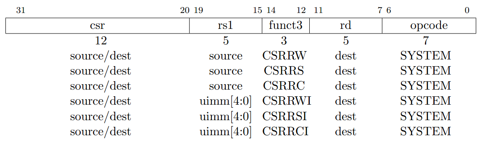


所有的CSR指令都是每次只能对一个CSR寄存器操作。


从上图我们可以看出，对于 CSR 指令：

- CODE[31:20]：csr，视为某个具体 CSR 的索引值，据此可确定当前 CSR 到底要访问哪一个寄存器。
其中：
    - CODE[31:30]：表征当前 CSR 寄存器是否可读写。
    - CODE[29:28]：表征当前 CSR 允许访问的最低用户权限（模式）。
    - CODE[27:20]：真正的 CSR 索引值。
- CODE[19:15]：rs1，可能需要使用源寄存器1，或者立即数。
- CODE[14:12]：funct3，CSR 指令根据不同的 funct3，可以确定不同的CSR指令。一定会用到目的寄存器，但是其 idx 值未知。
- CODE[11:7]：rd，目标寄存器。
- CODE[6:0]：opcode，必须为 1110011，被称为 SYSTEM。

RISC-V spec 一共定义了 6 种 CSR 指令，这 6 条 CSR 指令又可以分为两类:
- 寄存器操作：CSRRW，CSRRS，CSRRC
- 立即数操作：CSRRWI，CSRRSI，CSRRCI

对于立即数操作的 3 个指令，5 位的立即数被放在了 rs1 的位置，被称为 uimm[4:0]，因为这些立即数是无符号(unsigned immediate)的。

这 6 条 CSR 指令的 rd 与一般指令的目的寄存器没有差别，位于机器码的 bit 7-11，共 5 位的索引。


#### CSRRW 指令

    CSRRW(control and status register read and write，读后立即写控制状态寄存器)。
    指令格式：CSRRW rd，csr，rs1。t = CSRs[csr]; CSRs[csr] = x[rs1]; x[rd] = t

    该指令是把 CSR 寄存器中的值读出并赋值到 rd 寄存器中，再把 rs1 寄存器中的值写入 CSR 寄存器。

    机器码如下图所示：

    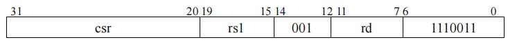

    CSRRW 的 funct3 是 001。

    示例：
    将 mie 寄存器里的值读出并赋值给 x13 寄存器，再把 x12 寄存器中的值写进 mie 寄存器。
    ```s
    CSRRW x13，mie，x12
    ```
    CSRRW 机器码为：
    - opcode 为 111_0011
    - funct3 为 001
    - mie 寄存器索引地址为 12’b0011_0000_0100
    - rs1 为 5’b0_1100
    - rd 为 5’b0_1101

#### CSRRS 指令

    CSRRS(control and status register read and set，读后置位控制状态寄存器)。
    指令格式：CSRRS rd，csr，rs1。t = CSRs[csr]; CSRs[csr] = t | x[rs1]; x[rd] = t

    该指令是把 CSR寄存器中的值读出并赋值到 rd 寄存器中，且将 CSR 寄存器中的值和寄存器rs1中的值按位或(bitwise OR)的结果写入CSR寄存器。

    机器码如下图所示：

    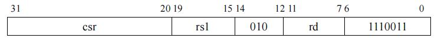

    CSRRS 的 funct3 是010。

    示例：将 mie 寄存器里面的值读出并赋值给 x13 寄存器，并将 mie 寄存器里的值和 x12 寄存器里的值按位或的结果写入 mie 寄存器中。
    ```s
    CSRRS x13，mie，x12
    ```


#### CSRRC 指令

    CSRRC(control and status register read and clear，读后清除控制状态寄存器)。
    指令格式：CSRRC rd，csr，rs1。t = CSRs[csr]; CSRs[csr] = t &~x[rs1]; x[rd] = t

    该指令是把CSR寄存器中的值读出并赋值到rd寄存器中，且将CSR寄存器中的值和寄存器rs1中的值取反后按位与(bitwise AND)的结果写入CSR寄存器。

    机器码如下图所示：

    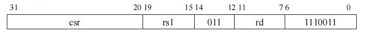

    示例：将mie寄存器里面的值读出并赋值给x13寄存器，并将mie寄存器里的值和x12寄存器里的值取反后按位与的结果写入mie寄存器中。
    ```s
    CSRRC x13，mie，x12
    ```

#### CSRRWI 指令

    CSRRWI(control and status register read and write immediate，立即数读后写控制状态寄存器)。
    指令格式：CSRRWI rd，csr，zimm[4:0]。x[rd] = CSRs[csr]; CSRs[csr] = zimm

    这里的zimm[4:0]表示高位由0(zero)扩展的立即数。

    该指令是把 CSR 寄存器中的值读出并赋值到 rd 寄存器中，再把五位的零扩展的立即数 zimm 写入 CSR 寄存器。

    机器码如下图所示：

    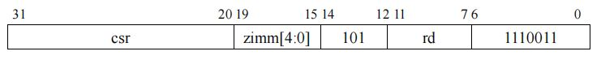

    CSRRWI 的 funct3 是 101。

    指令示例：将mie寄存器里的值读出并赋值给x13寄存器，再把5’b0_0101高位扩展0成32’h0000_0005写进mie寄存器
    ```s
    CSRRWI x13，mie，5
    ```

#### CSRRSI 指令

    CSRRSI(control and status register read and set immediate，立即数读后设置控制状态寄存器)。
    指令格式：CSRRSI rd，csr，zimm[4:0]。t = CSRs[csr]; CSRs[csr] = t | zimm; x[rd] = t

    该指令是把CSR寄存器中的值读出并赋值到rd寄存器中，且将CSR寄存器中的值和五位的零扩展的立即数zimm按位或(bitwise OR)的结果写入CSR寄存器(CSR寄存器的第五位及更高位不变)。

    机器码如下图所示：

    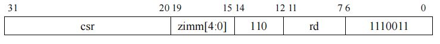

    CSRRSI 的 funct3 是 110。

    指令示例：将mie寄存器里的值读出并赋值给x13寄存器，再把5’b0_0101高位扩展0成32’h0000_0005和mie寄存器里的值按位或写进mie寄存器
    ```s
    CSRRSI x13，mie，5
    ```

#### CSRRCI指令

    CSRRCI(control and status register read and clear immediate，立即数读后清除控制状态寄存器)。
    指令格式为CSRRCI rd，csr，zimm[4:0]。t = CSRs[csr]; CSRs[csr] = t &~zimm; x[rd] = t

    该指令是把 CSR 寄存器中的值读出并赋值到 rd 寄存器中，且将 CSR 寄存器中的值和五位的零扩展的立即数 zimm 取反后按位与(bitwise AND)的结果写入 CSR 寄存器( CSR 寄存器的第五位及更高位不变)。

    机器码如下图所示：

    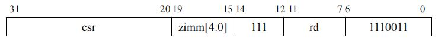

    CSRRCI 的 funct3 是 111。

    示例：将 mie 寄存器里的值读出并赋值给 x13 寄存器，再把 5’b0_0101 高位扩展 0 成 32’h0000_0005，取反后为 32’hFFFF_FFFA 和 mie 寄存器里的值按位与写进 mie 寄存器。
    ```s
    CSRRCI x13，mie，5
    ```

上述六种 CSR 指令配合特殊的源操作数索引和目的操作数索引(等于0或者不等于0)，就可以变化成众多的 CSR 伪指令。


### CSR 伪指令
CSR 伪指令是 RISC-V 指令集中的一种特殊指令，它通过读写 CSR 寄存器来完成一些特定的功能。
CSR 伪指令的格式如下：

伪指令格式：pseudoinstruction_name[csr_num]，rd，rs1，rs2

其中，pseudoinstruction_name 是伪指令的名字，csr_num 是 CSR 寄存器的编号。rd 是目的操作数，rs1 和 rs2 是源操作数。
常见的 CSR 伪指令有：csrr，csrw，csrs，csrc。

#### csrr
    csrr(control and status register read，读取控制状态寄存器)。
    指令格式为csrr rd，csr，zimm[4:0]。t = CSRs[csr]; x[rd] = t
    该指令是把 CSR 寄存器中的值读出并赋值到 rd 寄存器中。
    机器码如下图所示：
    
    csrr 的 funct3 是 001。
    示例：将 mie 寄存器里的值读出并赋值给 x13 寄存器。
    ```s
    CSRR x13，mie
    ```

#### csrw
    csrw(control and status register write，写入控制状态寄存器)。
    指令格式为csrw rd，csr，zimm[4:0]。CSRs[csr] = x[rs1]
    该指令是把 rs1 寄存器中的值写入 CSR 寄存器( CSR 寄存器的第五位及更高位不变)。
    机器码如下图所示：
    
    csrw 的 funct3 是 010。
    示例：将 x13 寄存器里的值写入 mie 寄存器。
    ```s
    CSRW mie，x13
    ```

#### csrs
    csrs(control and status register set，置位控制状态寄存器)。
    指令格式为csrs rd，csr，zimm[4:0]。CSRs[csr] |= zimm
    该指令是把 zimm 立即数按位或(bitwise OR)到 CSR 寄存器中。
    机器码如下图所示：
    
    csrs 的 funct3 是 011。
    示例：将 5’b0_0101 高位扩展 0 成 32’h0000_0005，取反后为 32’hFFFF_FFFA 和 mie 寄存器里的值按位与写进 mie 寄存器。
    ```s
    CSRRSI mie，(1 << 2)
    ```

#### csrc
    csrc(control and status register clear，清零控制状态寄存器)。
    指令格式为csrc rd，csr，zimm[4:0]。CSRs[csr] &= ~zimm
    该指令是把 zimm 立即数按位与(bitwise AND)到 CSR 寄存器中。
    机器码如下图所示：
    
    csrc 的 funct3 是 011。
    示例：将 5’b0_0101 高位扩展 0 成 32’h0000_0005，取反后为 32’hFFFF_FFFA 和 mie 寄存器里的值按位与写进 mie 寄存器。
    ```s
    CSRRCI mie，(1 << 2)
    ```

#### 总结

RISC-V 指令集中共有 7 种 CSR 伪指令，它们分别是 csrr，csrw，csrs，csrc，csrrwi，csrrsi，csrrci。
其中 csrr，csrw，csrs，csrc 被称为 CSR 指令，csrrwi，csrrsi，csrrci 被称为 CSRI 指令。
CSR 指令和 CSRI 指令的区别在于它们对 CSR 寄存器的操作方式不同。
CSR 指令把 CSR 寄存器的值读出或写入到通用寄存器中。
CSRI 指令把 CSR 寄存器的值读出或写入到 CSR 寄存器中。

包括伪指令在内，共有以下 7 种操作类型：

csrr，读取一个 CSR 的值到通用寄存器。如：csrr t0, mstatus，读取 mstatus 的值到 t0 中。
csrw，把一个通用寄存器中的值写入 CSR 中。如：csrw mstatus, t0，将 t0 的值写入 mstatus。
csrs，把 CSR 中指定的 bit 置 1。如：csrsi mstatus, (1 << 2)，将 mstatus 的右起第 3 位置 1。
csrc，把 CSR 中指定的 bit 置 0。如：csrci mstatus, (1 << 2)，将 mstatus 的右起第 3 位置 0。
csrrw，读取一个 CSR 的值到通用寄存器，然后把另一个值写入该 CSR。如：csrrw t0, mstatus, t0，将 mstatus 的值与 t0 的值交换。
csrrs，读取一个 CSR 的值到通用寄存器，然后把该 CSR 中指定的 bit 置 1。
csrrc，读取一个 CSR 的值到通用寄存器，然后把该 CSR 中指定的 bit 置 0。

这些指令都有 R 格式和 I 格式，I 格式的指令名需要在 R 格式的指令名之后附加字母 i，如 R 格式指令 csrr 对应的 I 格式指令为 csrri。具体的指令格式和执行机制请参考 RISC-V 非特权指令手册 的 Zicsr 节。
前 4 种操作 csrr / csrw / csrs / csrc 是伪指令，这些指令会由汇编器翻译成对应的 csrrw / csrrs / csrrc 指令。这样做是为了减少 CPU 需要实现的指令数量，使 CPU 的片上面积利用更高效。具体请参考 RISC-V 非特权指令集手册 的 RISC-V Assembly Programmer’s
Handbook 节。


### CSR 寄存器

RISC-V 的 CSR 寄存器非常多，下面列举一些后续经常使用到的寄存器。

在机器模式（Machine Mode）下这些存储器主要包括以下六类：

- 处理器信息相关：例如处理器的厂商信息，架构信息，核心数等等，是一个芯片自身的I固有信息。
- 中断配置相关：例如中断开关以及中断入口等信息。
- 中断响应相关：例如中断原因，中断返回地址等信息。
- 存储器保护相关：设置不同地址空间的存储器的访问属性，例如可读可写可执行等等。
- 性能统计相关和调试接口相关。

#### 机器模式信息寄存器组
##### MHARTID（Machine Hartid）
机器模式逻辑内核编号寄存器（MHARTID）存储了处理器核的硬件逻辑内核编号，具体是 MARATID 的最低三位指示了多核处理器的核心编号。 C906 中目前该寄存器值固定为 64’ h0。

该寄存器的位长是 64 位，寄存器的读写权限是机器模式只读，即非机器模式访问和机器模式写操作访问都会导致非法指令异常。

#### 机器模式异常处理寄存器组

##### MCAUSE（Machine Cause）
机器模式异常向量寄存器（MCAUSE）用于保存触发异常的异常事件向量号，用于在异常服务程序中处理对应事件。

该寄存器的位长是 64 位，寄存器的读写权限是机器模式可读写，即非机器模式访问都会导致非法指令异常。

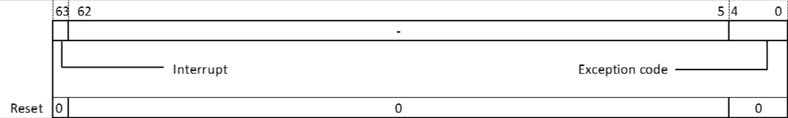

1. [64]Interrupt-中断标记位：
    - 当 Interrupt 位为 0 时，表示触发异常的来源不是中断， Exception Code 按照异常解析。
    - 当 Interrupt 位为 1 时，表示触发异常的来源是中断， Exception Code 按照中断解析。

    该位会被 reset 置为 1’ b0。

2. [4:0]Exception Code-异常向量号位：
在处理器响应异常或中断时，该域会被更新为对应异常号，具体请参考 异常和中断向量分配。

在 C906 中只使用了 [4:0] 共 5bit，该位会被 reset 置为 5’ b0。

##### MEPC（Machine Exception Program Counter）
机器模式异常保留程序计数器（MEPC）用于存储程序从异常服务程序退出时要返回的程序计数器值（即 PC 值）。 C906 支持 RVC 指令集， MEPC 的值以 16 位宽对齐，最低位为零。

- 如果发生的是异常,那么mepc指向的是发生异常的指令地址
- 如果发生的是中断，那么mepc指向的是发生中断的指令的下一条指令地址

该寄存器的位长是 64 位，寄存器的读写权限是机器模式可读写，即非机器模式访问都会导致非法指令异常。

##### MIP（Machine Interrupt Pending）

机器模式中断等待状态寄存器（MIP）用于保存处理器的中断等待状态。当处理器出现中断无法立即响应的情况时， MIP 寄存器中的对应位会被置位。

该寄存器的位长是 64 位，非机器模式访问都会导致非法指令异常。

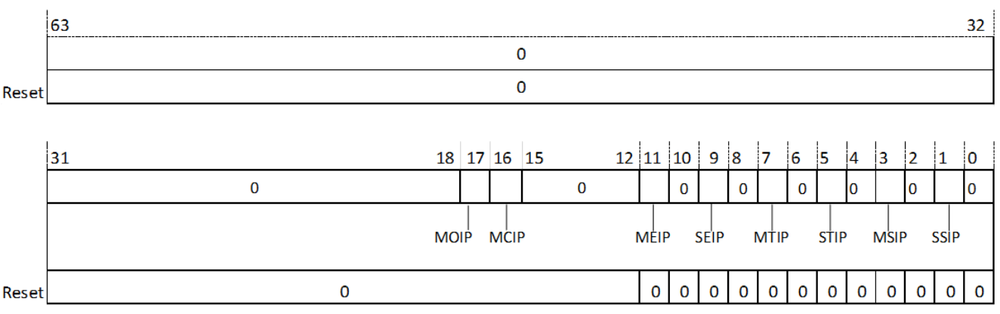

1. SSIP-超级用户模式软件中断等待位

    - 当 SSIP 为 0 时，处理器当前没有处于等待状态的超级用户模式软件中断。
    - 当 SSIP 为 1 时，处理器当前有处于等待状态的超级用户模式软件中断。

    该位会被 reset 置为 1’ b0，访问权限为机器模式可读写。

2. MSIP-机器模式软件中断等待位

    - 当 MSIP 为 0 时，处理器当前没有处于等待状态的机器模式软件中断。
    - 当 MSIP 为 1 时，处理器当前有处于等待状态的机器模式软件中断。

    该位会被 reset 置为 1’ b0，访问权限为机器模式只读。

3. STIP-超级用户模式计时器中断等待位
    - 当 STIP 为 0 时，处理器当前没有处于等待状态的超级用户模式计时器中断。
    - 当 STIP 为 1 时，处理器当前有处于等待状态的超级用户模式计时器中断。

    该位会被 reset 置为 1’ b0，访问权限为机器模式可读写。

4. MTIP-机器模式计时器中断等待位
    - 当 MTIP 为 0 时，处理器当前没有处于等待状态的机器模式计时器中断。
    - 当 MTIP 为 1 时，处理器当前有处于等待状态的机器模式计时器中断。

    该位会被 reset 置为 1’ b0，访问权限为机器模式只读。

5. SEIP-超级用户模式外部中断等待位

    - 当 SEIP 为 0 时，处理器当前没有处于等待状态的超级用户模式外部中断。
    - 当 SEIP 为 1 时，处理器当前有处于等待状态的超级用户模式外部中断。

    该位会被 reset 置为 1’ b0，访问权限为机器模式可读写。

6. MEIP-外部中断等待位

    - 当 MEIP 为 0 时，处理器当前没有处于等待状态的机器模式外部中断。
    - 当 MEIP 为 1 时，处理器当前有处于等待状态的机器模式外部中断。

    该位会被 reset 置为 1’ b0，访问权限为机器模式只读。

7. MOIP-机器模式事件计数器溢出中断等待位

    - 当 MOIP 为 0 时，处理器当前没有处于等待状态的机器模式计数器溢出中断。
    - 当 MOIP 为 1 时，处理器当前有处于等待状态的机器模式计数器溢出中断。

    该位会被 reset 置为 1’ b0，访问权限为机器模式只读。

##### MSCRATCH （Machine Scratch）

机器模式异常临时数据备份寄存器（MSCRATCH）用于处理器在异常服务程序中备份临时数据。一般用来存储机器模式本地上下文空间的入口指针值。

该寄存器的位长是 64 位，寄存器的读写权限是机器模式可读写，即非机器模式访问都会导致非法指令异常。

##### MTVAL（Machine Trap Value）
机器模式异常事件向量寄存器（MTVAL）用于保存异常事件的具体信息，比如地址例外中出错的地址、发生非法指令例外的指令本身等。
该寄存器的位长是 64 位，寄存器的读写权限是机器模式只读。

保存了陷入（trap）的附加信息：地址例外中出错的地址、发生非法指令例外的指令本身，对于其他异常，它的值为 0。


#### 机器模式异常配置寄存器组
##### MSTATUS（Machine Status）

机器模式处理器状态寄存器（MSTATUS）存储了处理器在机器模式下的状态和控制信息，包括全局中断有效位、异常保留中断有效位、异常保留特权模式位等。

该寄存器的位长是 64 位，寄存器的读写权限是机器模式可读写，即非机器模式访问都会导致非法指令异常。

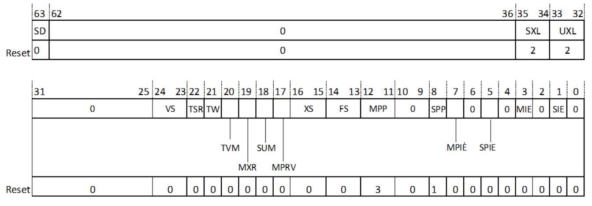

1. [1]SIE-全局超级用户模式中断使能位：
    - 当 SIE 为 0 时，超级用户中断无效；
    - 当 SIE 为 1 时，超级用户中断有效；
    该位会被 reset 清零，处理器被降级到超级用户模式响应中断时被清零；在处理器退出中断服务程序时被置为 SPIE 的值。

2. [3]MIE：机器模式全局中断使能位
    - 当 MIE 为 0 时，中断无效；
    - 当 MIE 为 1 时，中断有效。
    该位复位值为零，也在处理器响应异常时被清零；在处理器退出异常时被置为 MPIE 的值。

3. [5]SPIE-超级用户模式保留中断使能位：

    该位用于保存处理器在降级到超级用户模式响应中断前 SIE 位的值。
    
    该位会被 reset 清零，在处理器退出中断服务程序时被置 1。

4. [7]MPIE：机器模式保留中断使能位

    该位用于保存处理器进入异常服务程序前 MIE 位的值。该位复位值为零，在处理器退出异常服务程序时被置 1。

5. [8]SPP-超级用户模式保留特权状态位：

    该位用于保存处理器在降级到超级用户模式进入异常服务程序前的特权状态。
    - 当 SPP 为 2’ b00 时，表示处理器进入异常服务程序前处于用户模式；
    - 当 SPP 为 2’ b01 时，表示处理器进入异常服务程序前处于超级用户模式；

    该位会被 reset 置 2’ b01。

6. [12:11]MPP：机器模式保留特权状态位

    该位用于保存处理器进入异常服务程序前的特权状态。
    - 当 MPP 为 2’ b00 时，表示处理器进入异常服务程序前处于用户模式；
    - 当 MPP 为 2’ b11 时，表示处理器进入异常服务程序前处于机器模式；
    
    该域复位值为 2’ b11。

7. [14:13]FS：浮点寄存器状态位

    根据浮点状态位，可以判断上下文切换的时候，是否需要保存浮点相关寄存器。
    - 当 FS 为 2’ b00 时，浮点单元处于关闭状态，此时访问浮点相关寄存器会触发非法指令异
    常。
    - 当 FS 为 2’ b01 时，浮点单元处于初始化状态。
    - 当 FS 为 2’ b10 时，浮点单元处于 clean 态。
    - 当 FS 为 2’ b11 时，浮点单元处于 dirty 态，表明浮点寄存器和控制寄存器被修改过。

    该位会被 reset 置为 2’ b00。

8. [16:15]XS：用户模式浮点扩展状态位

    C906 没有扩展单元，固定为 0。

9. [17]MPRV：存储特权位

    - 当 MPRV=1 时，加载和存储请求执行时根据 MPP 中的特权态进行执行。
    - 当 MPRV=0 时，加载和存储请求执行时根据当前处理器所处特权模式进行执行。
    
    该位会被 reset 置为 1’ b0。

10. [18]SUM-允许超级用户模式下访问 U 态虚拟内存空间

    - 当 SUM=1 时，超级用户模式下，加载、存储和取指令请求可以访问标记为用户态的虚拟内存空间。
    - 当 SUM=0 时，超级用户模式下，加载、存储和取指令请求不可以访问标记为用户态的虚拟内存空间。

    该位会被 reset 置为 1’ b0。

11. [19]MXR-允许加载请求访问标记为可执行的内存空间
    - 当 MXR=1 时，允许加载请求访问标记为可执行和可读的虚拟内存空间。
    - 当 MXR=0 时，允许加载请求只能访问标记为可读的虚拟内存空间。

    该位会被 reset 置为 1’ b0。

12. [20]TVM-陷阱虚拟内存

    - 当 TVM=1 时，超级用户模式读写 SATP 控制寄存器以及执行 SFENCE 指令，触发非法指令异常。
    - 当 TVM=0 时，超级用户模式可以读写 SATP 控制寄存器以及执行 SFENCE 指令。

    该位会被 reset 置为 1’ b0。

13. [21]TW-超时等待

    - 当 TW=1 时，超级用户模式执行低功耗指令 WFI，触发非法指令异常。
    - 当 TW=0 时，超级用户模式执行低功耗指令 WFI。

14. [22]TSR-陷阱 SRET

    - 当 TSR=1 时，超级用户模式执行 SRET 指令，产生非法指令异常。
    - 当 TSR=0 时，允许超级用户模式执行 SRET 指令。

    该位会被 reset 置为 1’ b0。

15. [24:23]VS-矢量单元状态位

    根据矢量状态位，可以判断上下文切换的时候，是否需要保存矢量相关寄存器。
    - 当 VS 为 2’ b00 时，矢量单元处于关闭状态，此时访问矢量相关寄存器会触发非法指令异常。
    - 当 VS 为 2’ b01 时，矢量单元处于初始化状态。
    - 当 VS 为 2’ b10 时，矢量单元处于 clean 态。
    - 当 VS 为 2’ b11 时，矢量单元处于 dirty 态，表明矢量寄存器和矢量控制寄存器被修改过。

    VS 位仅当配置矢量执行单元时有效，不配置时恒为 0，该位会被 reset 置为 2’ b00。

16. [33:32]UXL-U 态寄存器位宽

    只读，固定值是 2，表示在 U 态下，寄存器的位宽是 64bit。

17. [35:34]SXL-S 态寄存器位宽

    只读，固定值是 2，表示在 S 态下，寄存器的位宽是 64bit。

18. [63]SD-浮点、矢量和扩展单元 dirty 状态总和位

    - 当 SD=1 时，表明浮点或矢量或扩展单元处在 dirty 状态。
    - 当 SD=0 时，表明浮点、矢量和扩展单元处都不处在 dirty 状态。
    
    该位会被 reset 置为 1’ b0。

##### MIE（Machine Interrupt Enable）
机器模式中断使能控制寄存器（MIE）用于控制机器模式下 CLINT 中不同中断类型的局部屏蔽。

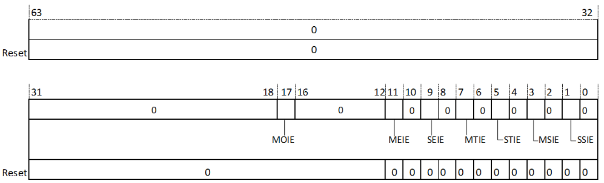

1. [1]SSIE-超级用户模式软件中断使能位

    - 当 SEIE 为 0 时，超级用户模式软件外部中断未始能。
    - 当 SEIE 为 1 时，超级用户模式软件外部中断被始能。
    
    该位会被 reset 置为 1’ b0。

2. [3]MSIE-机器模式软件中断使能位

    - 当 MSIE 为 0 时，机器模式软件中断未始能。
    - 当 MSIE 为 1 时，机器模式软件中断被始能。

    该位会被 reset 置为 1’ b0。

3. [5]STIE-超级用户模式计时器中断使能位

    - 当 STIE 为 0 时，超级用户模式计时器中断未始能。
    - 当 STIE 为 1 时，超级用户模式计时器中断被始能。

    该位会被 reset 置为 1’ b0。

4. [7]MTIE-机器模式计时器中断使能位

    - 当 MTIE 为 0 时，机器模式计时器中断未始能。
    - 当 MTIE 为 1 时，机器模式计时器中断被始能。

    该位会被 reset 置为 1’ b0。

5. [9]SEIE-超级用户模式外部中断使能位

    - 当 SEIE 为 0 时，超级用户模式外部中断未始能。
    - 当 SEIE 为 1 时，超级用户模式外部中断被始能。
    
    该位会被 reset 置为 1’ b0。

6. [11]MEIE-机器模式外部中断使能位

    - 当 MEIE 为 0 时，机器模式外部中断未始能。
    - 当 MEIE 为 1 时，机器模式外部中断被始能。

    该位会被 reset 置为 1’ b0。

7. [17]MOIE-性能监测单元机器模式事件计数器溢出中断使能位

    - 当 MOIE 为 0 时，机器模式计数器溢出中断未始能。
    - 当 MOIE 为 1 时，机器模式计数器溢出中断被始能。

    该位会被 reset 置为 1’ b0。

##### MTVEC（Machine Trap Vector）

机器模式向量基址寄存器（MTVEC）用于配置异常服务程序的入口地址。

该寄存器的位长是 64 位，寄存器的读写权限是机器模式可读写，即非机器模式访问都会导致非法指令异常。

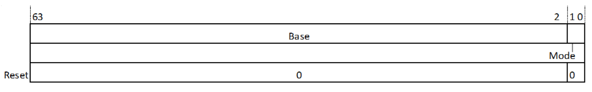

1. [63:2]BASE-向量基址位

    向量基址位指示了异常服务程序入口地址的高 37 位，将此基址拼接 2’ b00 即可得到异常服务程序入口地址。

    该位在复位后置为 62’ h0。

2. [1:0]MODE-向量入口模式位

    - 当 MODE[1:0] 为 2’ b00 时，异常和中断都统一使用 BASE 地址作为异常入口地址。
    - 当 MODE[1:0] 为 2’ b01 时，异常使用 BASE 地址作为入口地址，中断使用 BASE +4*Exception Code。
    
    该位会被 reset 置为 2’ b00。

