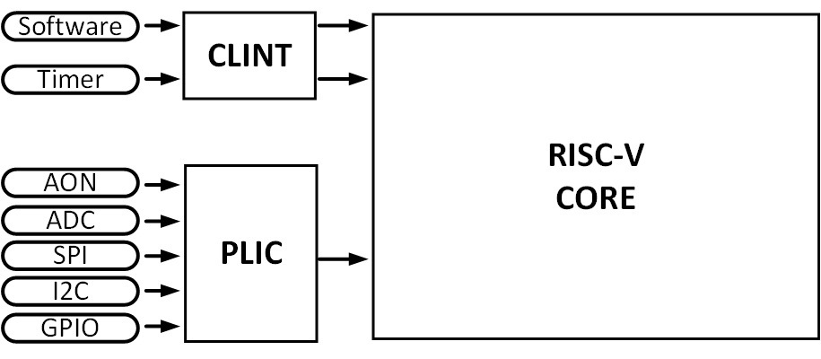

# 4、异常与中断
## 4.1、概述
### 异常

异常，即处理器在顺序执行程序指令流的过程中突然遇到了异常的事情而中止执行当前的程序，转而去执行别的事情。

异常处理是处理器的一项重要功能，在某些异常事件产生时，使处理器转入对这些事件的处理。这些事件包括硬件处理、指令执行错误、用户程序请求服务等。

异常被分为两种：

- 同步异常：执行某个程序流，能稳定复现的的异常，能比较精确的确定是那条指令引发的异常。（例如程序流里有一条非法指令，属于内因。）

- 异步异常：异常产生的原因与当前的程序流无关，与外部的中断事件有关。（由外部事件引起的，属于外因。）

### 中断

中断，即处理器在顺序执行程序指令流的过程中突然被别的请求打断而中止执行当前的程序，转而去执行别的事情，待其处理完了别的事情后，重新回到之前程序中断的点继续执行之前的程序指令流。

在 RISC-V 中，中断（interrupt）和异常（exception）被统称为 trap。

## 4.2、RISC-V 中断架构
RISC-V 中断被分为两类局部中断和全局中断。

- 局部中断，算是内部中断，标准是只规定了有两种，即使系统定时器中断和软件中断。局部中断连接在 CLINT（Core Local Interruptor）上。
- 全局中断，也就是所说的外部中断，其他外设统统都是外部中断。外部中断连接在 PLIC（Platform-Level Interrupt Controlle）上。

CLINT 和 PLIC 最大的区别在于，CLINT 没有仲裁，包括 software 和 timer，一有中断马上响应，PLIC 需要一个仲裁决定谁先中断，存在个优先级的问题。

### CLINT
CLINT 占据 64KB 内存空间，其高 13 位地址由 SoC 集成 C906 时硬件指定，低 27 位地址映射下表所示。

| 地址 | 名称 | 属性 | 初始值 | 描述 |
| - | - | - | - | - |
| 0x4000000 | MSIP0 | 读/写 | 0x00000000 | 机器模式软件中断配置寄存器高位绑 0， bit[0] 有效 |
| Reserved | - | - | - | - |
| 0x4004000 | MTIMECMPL0 | 读/写 | 0xFFFFFFFF | 机器模式系统计时器比较值寄存器 (低 32 位) |
| 0x4004004 | MTIMECMPH0 | 读/写 | 0xFFFFFFFF | 机器模式系统计时器比较值寄存器 (高 32 位) |
| Reserved | - | - | - | - |
| 0x400C000 | SSIP0 | 读/写 | 0x00000000 | 超级用户模式软件中断配置寄存器高位绑 0， bit[0] 有效 |
| Reserved | - | - | - | - |
| 0x400D000 | STIMECMPL0 | 读/写 | 0xFFFFFFFF | 超级用户模式系统计时器比较值寄存器 (低 32 位) |
| 0x400D004 | STIMECMPH0 | 读/写 | 0xFFFFFFFF | 超级用户模式系统计时器比较值寄存器 (高 32 位) |
| Reserved | - | - | - | - |

所有寄存器仅支持字对齐的访问。

### PLIC
PLIC 的全称 Platform-Level Interrupt Controller，平台级中断控制器，用来将外部的全局中断请求处理后转至中断目标。

PLIC理论上支持 1023 个外部中断源和 15872 个上下文，但真实设计实现时一般不需要这么多。

C906 为 PLIC 中断控制器保留分配了 64MB 的内存空间。其高 13 位地址由 SoC 集成使用 C906 时配置决定，低 27 位地址映射如下表所示。

| 地址 | 名称 | 类型 | 初始值 | 描述 |
| - | - | - | - | - |
| 0x0000004 | PLIC_PRIO1 | R/W | 0x0 | 1-1023 号中断的优先级配置寄存器 |
| 0x0000008 | PLIC_PRIO2 | R/W | 0x0 |  |
| 0x000000C | PLIC_PRIO3 | R/W | 0x0 |  |
| … | … | … | … |
| 0x0000FFC | PLIC_PRIO1023 | R/W | 0x0 |
| 0x0001000 | PLIC_IP0 | R/W | 0x0 | 1-31 号中断的中断等待寄存器 |
| 0x0001004 | PLIC_IP1 | R/W | 0x0 | 32-63 号中断的中断等待寄存器 |
| … | … | … | … | … |
| 0x000107C | PLIC_IP31 | R/W | 0x0 | 992- 1023 号中断的中断等待寄存器 |
| Reserved - - - - |
| 0x0002000 | PLIC_H0_MIE0 | R/W | 0x0 | 1-31 号中断的机器模式中断使能寄存器 |
| 0x0002004 | PLIC_H0_MIE1 | R/W | 0x0 | 32-63 号中断的机器模式中断使能寄存器 |
| … | … | … | … | … |
| 0x000207C | PLIC_H0_MIE31 | R/W | 0x0 | 992-1023 号中断的机器模式中断使能寄存器 |
| 0x0002080 | PLIC_H0_SIE0 | R/W | 0x0 | 1-31 号中断的超级用户模式中断使能寄存器 |
| 0x0002084 | PLIC_H0_SIE1 | R/W | 0x0 | 32-63 号中断的超级用户模式中断使能寄存器 |
| … | … | … | … | … |
| 0x00020FC | PLIC_H0_SIE31 | R/W | 0x0 | 992 -1023 号中断的超级用户模式中断使能寄存器 |
| Reserved | - | - | - | - |
| 0x01FFFFC | PLIC_CTRL | R/W | 0x0 | PLIC 权限控制寄存器 |
| 0x0200000 | PLIC_H0_MTH | R/W | 0x0 | 机器模式中断阈值寄存器 |
| 0x0200004 | PLIC_H0_MCLAIM | R/W | 0x0 | 机器模式中断响应/完成寄存器 |
| Reserved | - | - | - | - |
| 0x0201000 | PLIC_H0_STH | R/W | 0x0 | 超级用户模式中断阈值寄存器 |
| 0x0201004 | PLIC_H0_SCLAIM | R/W | 0x0 | 超级用户模式中断响应/完成寄存器 |
| Reserved | - | - | - | - |

所有寄存器仅支持地址字对齐的访问。 （PLIC 的寄存器要通过字访问指令（Load word 指令）访问，访问结果放在 64 位 GPR 的低 32 位。）

### 4.3、寄存器
异常相关的 8 个控制状态寄存器（CSR）是机器模式下异常处理的必要部分：
1. MTVEC
2. MEPC
3. MCUASE
4. MIE
5. MIP
6. MTVAL
7. MSCRATCH
8. MSTATUS

### 异常处理机制

异常处理 (包括指令异常和外部中断) 是处理器的一项重要功能。在某些异常事件产生时，异常处理功能用来使处理器转入对这些异常事件的处理。这些异常事件包括硬件错误、指令执行错误、用户程序请求服务等。

异常处理功能的关键是在异常事件发生时，可以保存处理器当前运行的状态，在处理器退出异常处理后将处理器恢复为异常处理前的运行状态。异常能够在流水线的各个阶段被识别，硬件会保证触发异常的后续指令不会改变处理器的状态。异常在指令的边界上被处理，即处理器在指令退休时响应异常，并保存退出异

常处理并返回执行的指令地址。即使异常指令退休前被识别，异常也要在相应的指令退休时才会被处理。为了程序功能的正确性，处理器在异常处理结束后要避免重复执行已执行完成的指令。

以在机器模式响应异常为例，具体步骤为：
1. 处理器保存异常指令 PC 到 MEPC 中。
2. 根据发生的异常类型设置 MCAUSE，并更新 MTVAL 为出错的取指地址、存储/加载地址或者指令码。
3. 将 MSTATUS 的中断使能位域 MIE 保存到 MPIE 域中，将 MIE 域的值清零，禁止响应中断。
4. 将发生异常之前的权限模式保存到 MSTATUS 的 MPP 域中，切换到机器模式（没有做异常降级响应处理的话）。
5. 根据 MTVEC 中的基址和模式，得到异常服务程序入口地址。处理器从异常服务程序的第一条指令处开始执行，进行异常的处

RISC-V 标准的异常向量表如下表所示：

| 中断标记 | 异常向量号 | 描述 |
| ------- | ---------- | ------ |
| 1 | 0 | 未实现 |
| 1 | 1 | 超级用户模式软件中断 |
| 1 | 2 | 保留 |
| 1 | 3 | 机器模式软件中断 |
| 1 | 4 | 未实现 |
| 1 | 5 | 超级用户模式计时器中断 |
| 1 | 6 | 保留 |
| 1 | 7 | 机器模式计时器中断 |
| 1 | 8 | 未实现 |
| 1 | 9 | 超级用户模式外部中断 |
| 1 | 10 | 保留 |
| 1 | 11 | 机器模式外部中断 |
| 1 | 17 | 性能监测溢出中断（如配置性能监测单元） |
| 1 | 其他 | 保留 |
| 0 | 0 | 未实现 |
| 0 | 1 | 取指令访问错误异常 |
| 0 | 2 | 非法指令异常 |
| 0 | 3 | 调试断点异常 |
| 0 | 4 | 加载指令非对齐访问异常 |
| 0 | 5 | 加载指令访问错误异常 |
| 0 | 6 | 存储/原子指令非对齐访问异常 |
| 0 | 7 | 存储/原子指令访问错误异常 |
| 0 | 8 | 用户模式环境调用异常 |
| 0 | 9 | 超级用户模式环境调用异常 |
| 0 | 10 | 保留 |
| 0 | 11 | 机器模式环境调用异常 |
| 0 | 12 | 取指令页面错误异常 |
| 0 | 13 | 加载指令页面错误异常 |
| 0 | 14 | 保留 |
| 0 | 15 | 存储/原子指令页面错误异常 |
| 0 | >= 16 | 保留 |

RISC-V 架构规定，进入异常和退出异常中没有硬件自动保存和恢复上下文的操作，因此需要软件明确地使用指令进行上下文的保存和恢复。

## 2、中断
RISC-V 架构一共定义了下面几种中断类型：

1. 外部中断：属于全局中断 PLIC

2. 计时器中断、软件中断：属于本地中断 CLINT

3. 调试中断：属于本地中断 Debug

### 中断处理机制
RISC-V 架构中断流程如下：

1. 外设发出中断信号
2. PLIC 或者 CLINT 响应中断，RISC-V 核心保存此时的 CSR 寄存器
3. 跳转到中断处理程序（直接换 PC 值取指令即可）
4. 关闭其他中断响应使能（RISC-V 不支持嵌套，所以一个中断要屏蔽其他中断）
5. 软件保存通用的寄存器
6. 然后处理中断（过程中会清掉外设的中断）
7. 软件恢复通用的寄存器
8. 然后恢复步骤 2 保存的 CSR 寄存器
9. 然后跳转 PC 跳回原来位置退出异常