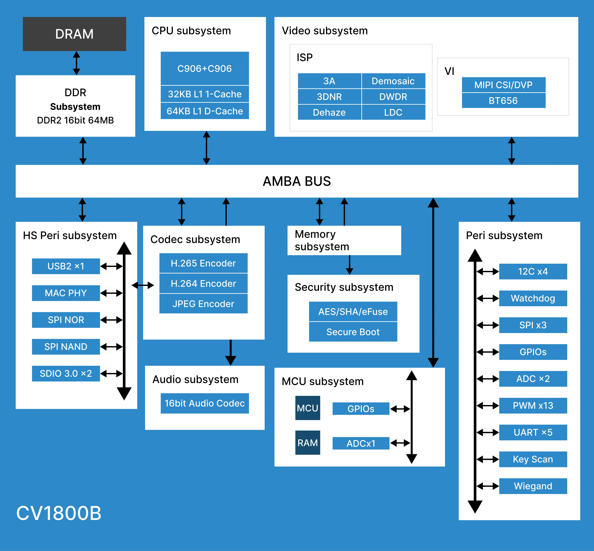
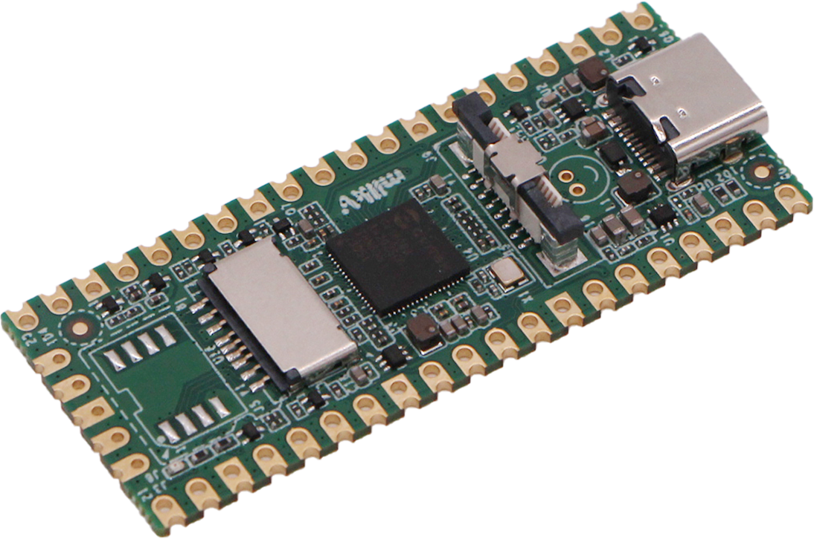

# 5、CV1800B概述
CV1800B 是一款高性能、低功耗的芯片，专为各种消费级监控IP摄像头、家居智能等产品设计。它集成了 H.264/H.265 视频压缩编码器和 ISP，支持数字宽动态范围、3D 降噪、去雾和镜头畸变校正等多种图像增强和修正算法，为客户提供专业级视频图像质量。

该芯片还集成了自主开发的智能参考设计（人体检测、区域检测、运动检测），内置 DDR 和完整的外围设备，为客户产品的开发和量产提供了高度集成和简洁的解决方案。

此外，它还提供了安全启动、安全更新和安全加密等功能，为用户从开发、量产到产品应用提供了一系列安全解决方案。

该系列芯片包括 CV180X、CV181X 等多个系列。

## 5.2、CPU 规格与特点

### 处理器内核
- 主处理器 RISCV C906 @ 1.0Ghz
    - 32KB I-cache, 64KB D-Cache
    - 集成矢量(Vector)及浮点运算单元 (FPU)

- 协处理器 RISCV C906 @ 700Mhz
    - 集成浮点运算单元 (FPU)

### TPU
内建 CVITEK TPU, 集成智能参考方案 (人形检测,区域检测,移动检测)

 
### 视频接口
- 支持同时一路视频输入(mipi 4L)
- 支持 MIPI 串行接口.
- 支持 8/10/12 bit RGB Bayer 视频输入.
- 支持 BT.656
- 支持 SONY, OnSemi, OmniVision 等高清 CMOS sensor
- 提供可编程频率输出供 sensor 作为参考时钟.
- 支持最大宽度为 2688 , 最大分辨率 2688x1520 (CV1800B)
- 支持最大宽度为 2880 , 最大分辨率 2880x1620 (CV1801B)

### 视频编码 (CV1800B/CV1801B)
- H.264 Baseline/Main/High profile
- H.265 Main profile
- H.264/H.265 均支援 I 帧及 P 帧
- MJPEG/JPEG baseline
- H.264/H.265 编码最大分辨率 : 2880x1620 (5M) (CV1801B)
- H.264/H.265 编码最大分辨率 : 2688x1520 (4M) (CV1800B)
- H.264/H.265 编码性能
- 2880x1620@20fps+720x576@20fps (CV1801B)
- 2688x1520@25fps+720x576@25fps (CV1800B)
- JPEG 最大编解码性能
- 2880x1620@20fps (CV1801B)
- 2688x1520@25fps (CV1800B)
- 支持 CBR/VBR/FIXQP 等多种码率控制模式.
- 支持 感兴趣区域 (ROI) 编码

### ISP 与图像处理

图像视频 90 度、180 度、270 度旋转
- 图像视频 Mirror、Flip 功能
- 视频 2 层 OSD 叠加
- 视频 1/32～32x 缩放功能
- 3A（AE/AWB/AF）算法
- 固定模式噪声消除、坏点校正
- 镜头阴影校正、镜头畸变校正、紫边校正
- 方向自适应 demosaic
- Gamma 校正、(区域/全局)动态对比度增强、颜色管理和增强
- 区域自适应去雾
- Bayer 降噪、3D 降噪、细节增强及锐化增强
- Local Tone mapping
- Sensor 自带宽动态和 2 帧宽动态
- 两轴数字图像防抖
- 镜头畸变校正
- 提供 PC 端 ISP tuning tools

### 音频编解码
- 集成 Audio CODEC, 支持 16 bit 音源/语音 输入和输出
- 集成单声道麦克风输入
- 集成单声道输出. (需要外挂功放才能推动喇叭)
- 内部集成另一路的麦克风直连输出声道, 方便实现 AEC

### 外围接口 (CV1800B/CV1801B)
- 集成 POR, Power sequence
- 3 个单端 ADC (1 in mcu domain)
- 4 个 I2C
- 3 个 SPI
- 5 组 UART
- 4 组(13 通道) PWM
- 2 个 SDIO 接口
- 一个支持 3V 连接 SD 3.0 Card(支持最大容量 SDXC 2TB, 支持速度为 UHSI)
- 一个支持 3.0V 连接其他 SDIO 3.0 设备.(支持速度为 UHS-I)
- 51 GPIO 接口 (9 in mcu domain)
- 集成 keyscan 及 Wiegand
- 集成 MAC PHY 支持 10/100Mbps 全双工或半双工模式.
- 一个 USB Host / device 接口

### 网络接口
以太网模块提供 1 个 Ethernet MAC , 实现网路数据的接收与发送。Ethernet MAC 搭配内建 10/100Mbps Fast Ethernet Transceiver 可工作在 10/100Mbps 全双工或半双工模式。
 
### 外部存储器接口
- 内建 DRAM
    - CV1800B DDR2 16bitx1, 最高速率达 1333Mbps , 容量 512Mbit(64MB)
    - CV1801B DDR3 16bitx1, 最高速率达 1866Mbps, 容量 1Gbit(128MB)
- SPI NOR flash 接口 (1.8V / 3.0V)
    - 支持 1, 2, 4 线模式.
    - 最大支持 256MByte.
- SPI Nand flash 接口 (1.8V / 3.0V)
    - 支持 1KB/2KB/4KB page (对应的最大容量 16GB/32GB/64GB)
    - 使用器件本身内建的 ECC 模块.

## 5.2、开发板
Milk-V Duo 是一个基于 CV1800B 芯片的超紧凑嵌入式开发平台，它可以运行 Linux 和 RTOS，为专业人士、工业 ODM、AIoT 爱好者、DIY 爱好者和创作者提供了一个可靠、低成本和高性能的平台。

### 外设
​
MilkV-Duo 40 针针座上有多达 26 个 GPIO 引脚，可以访问内部外设，如 SDIO、I2C、PWM、SPI、J-TAG 和 UART。
- Up to 3x I2C
- Up to 5x UART
- Up to 1x SDIO1
- Up to 1x SPI
- Up to 2x ADC
- Up to 7x PWM
- Up to 1x RUN
- Up to 1x JTAG

更多 Milk-V Duo 开发板详细信息可在官网 [https://milkv.io](https://milkv.io) 了解。

可以至官方论坛：[https://community.milkv.io](https://community.milkv.io) 技术交流。

## 5.3、资料汇总
1. [算能技术论坛](https://developer.sophgo.com/forum/index/25/51.html)
2. [CV181x/CV180x MMF SDK 开发文档汇总](https://developer.sophgo.com/thread/471.html)
3. [CV181x/CV180x HDK 开发文档汇总](https://developer.sophgo.com/thread/472.html)
4. [CV系列芯片 TPU SDK 开发资料汇总](https://developer.sophgo.com/thread/473.html)
5. [CV1800B 外设寄存器手册](https://github.com/milkv-duo/duo-files/blob/main/duo/datasheet/CV1800B-CV1801B-Preliminary-Register-full-zh.pdf)
6. [CV1800B 大/小核 中断序号](https://github.com/milkv-duo/duo-files/blob/main/duo/datasheet/CV180xb-Pinout-v1.xlsx)
7. [CV1800B 管脚映射表](https://github.com/milkv-duo/duo-files/blob/main/duo/datasheet/CV180xb-Pinout-v1.xlsx)
8. [Milk-v duo 硬件原理图](https://github.com/milkv-duo/duo-files/blob/main/duo/hardware/duo-schematic-v1.2.pdf)
9. [Milk-v duo Linux SDK](https://github.com/milkv-duo/duo-buildroot-sdk)