# 6、快速上手

## 6.1、开发环境搭建
cv1800b 目前只支持 Linux 环境下的开发，不支持 Windows 环境。在 Windows 环境下，可以使用 WSL 进行开发。

### Linux 环境搭建

推荐使用 Windows + Linux 虚拟机方式进行开发，Windows 通过 ssh 连接虚拟机编译，通过 samba 与 Linux 共享文件。

可使用 VMware Workstation Player 或者 VirtualBox 创建虚拟机，本文以 VMware Workstation Player 为例简单介绍 Linux 虚拟机环境搭建，Linux 采用 Ubuntu 22.04。

#### 虚拟机环境搭建
1. VMware Workstation Player 下载与安装
    VMware Workstation Player 可在非商业用途免费使用。

    可在 vmware 官网 [https://www.vmware.com/products/workstation-player.html](https://www.vmware.com/products/workstation-player.html) 下载 VMware Workstation Player。

    当前最新版本为 17.5.1，可在 [https://customerconnect.vmware.com/en/downloads/details?downloadGroup=WKST-PLAYER-1751&productId=1377&rPId=117008](https://customerconnect.vmware.com/en/downloads/details?downloadGroup=WKST-PLAYER-1751&productId=1377&rPId=117008) 下载。

    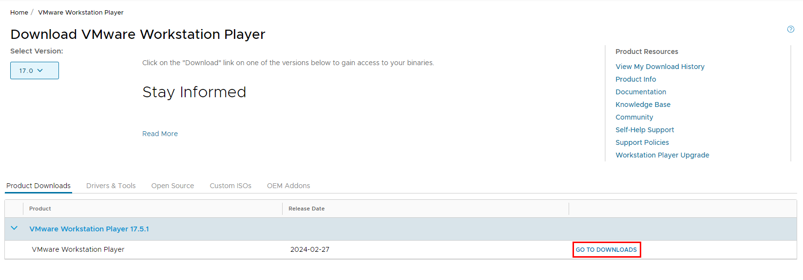

    下载完成后，双击安装包进行安装。

2. Ubuntu 22.04 下载

    在 ubuntu 官网 [https://ubuntu.com/download/desktop](https://ubuntu.com/download/desktop) 下载 Ubuntu 22.04。
    
    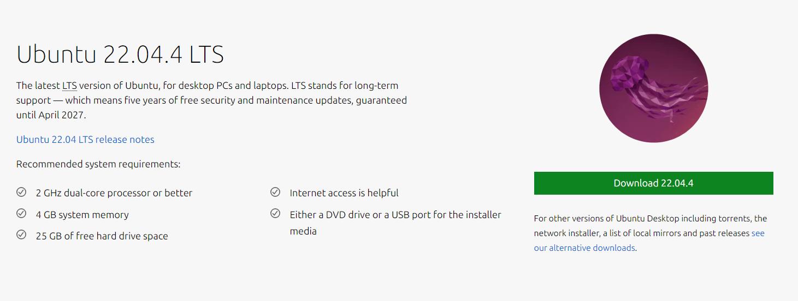

    点击 [https://releases.ubuntu.com/22.04.4/ubuntu-22.04.4-desktop-amd64.iso](https://releases.ubuntu.com/22.04.4/ubuntu-22.04.4-desktop-amd64.iso) 直接下载。


3. 虚拟机环境搭建

    打开 VMware Workstation Player，点击创建新的虚拟机。

    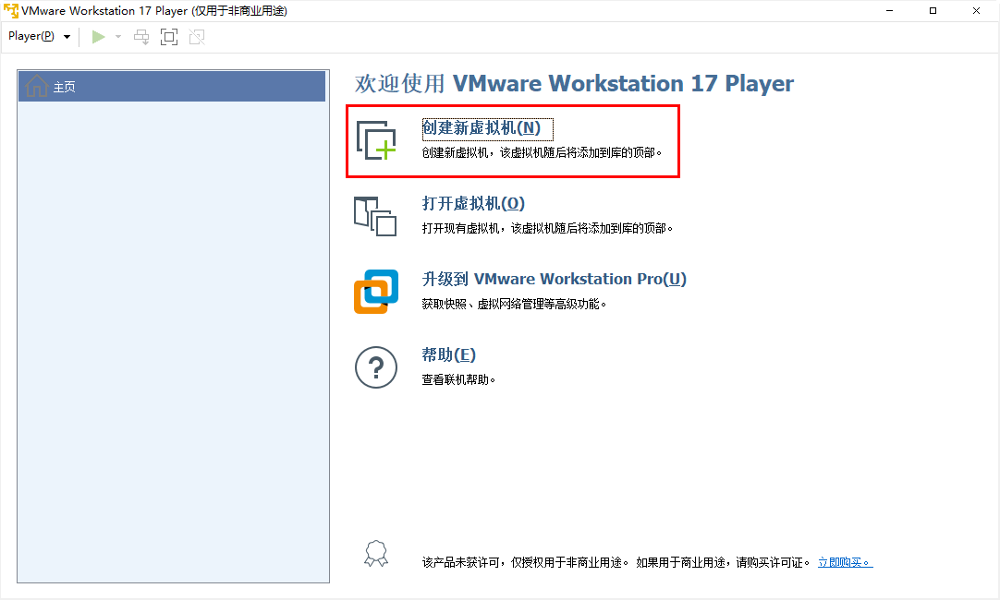

    添加步骤 2 中下载的 Ubuntu 22.04 镜像文件，点击下一步。

    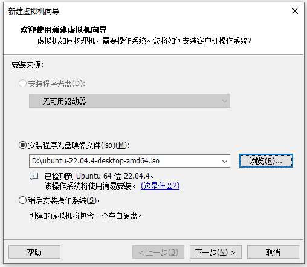


    设置虚拟机名称、安装位置、虚拟机内存大小、虚拟机 CPU 数量，点击下一步开始安装。
    
    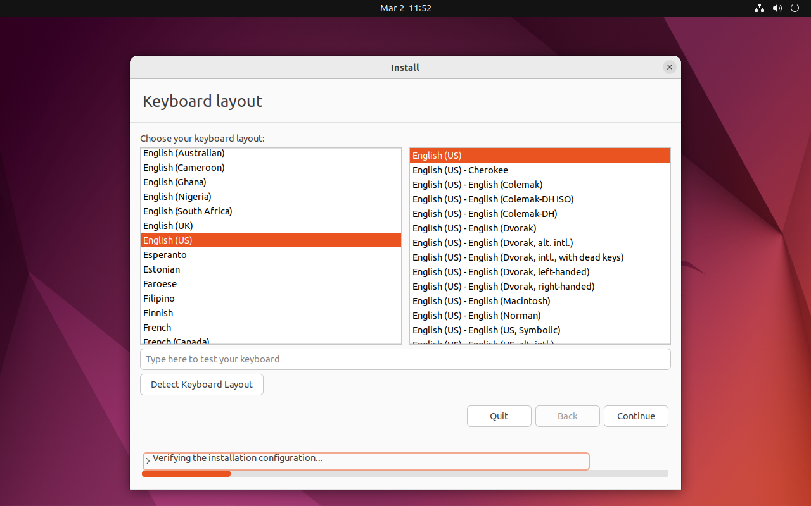

    在配置界面选择 `Minimal installtion`，点击下一步。

    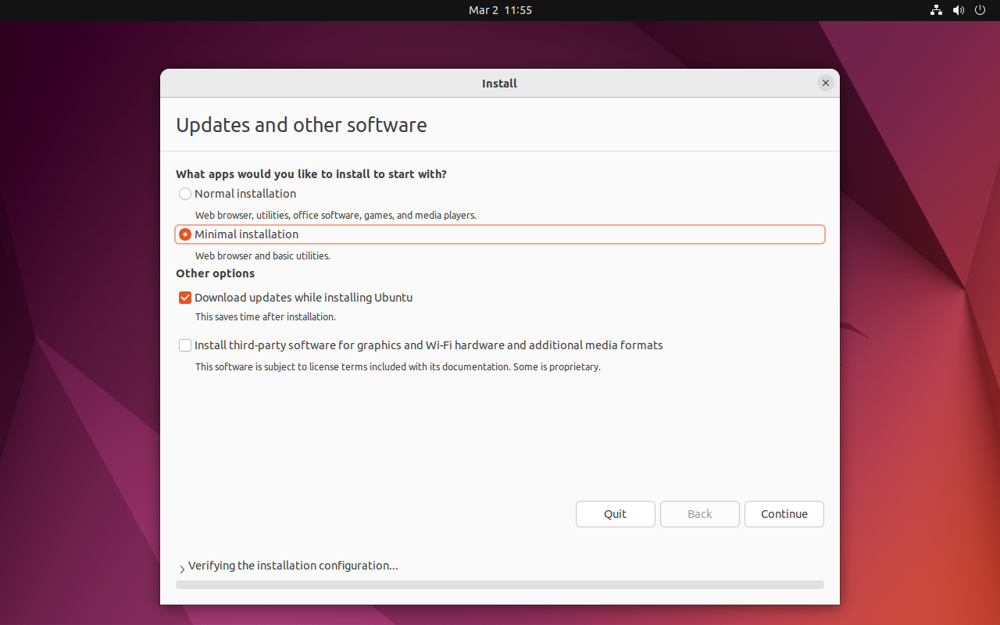
    
    在安装类型页面选择 ，并点击下一步。
    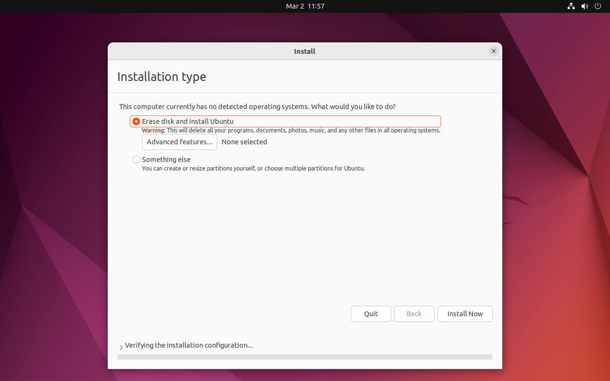
    
    根据安装提示输入相关信息后，等待安装完成。
    
    安装完成后进入 Ubuntu 系统。

    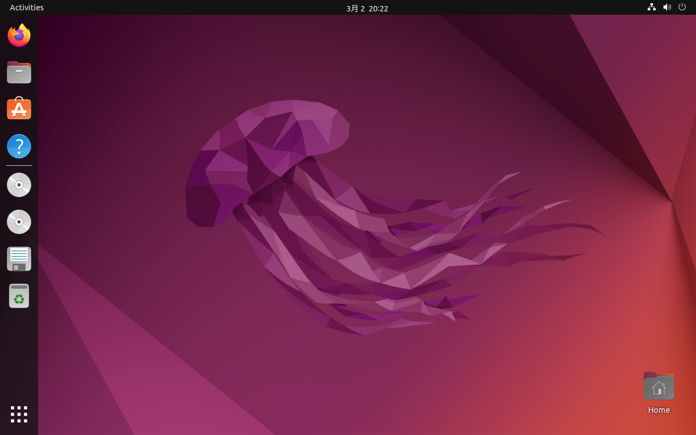

#### ubuntu 配置
为了方便后续操作，需要对 Ubuntu 系统进行一些基本配置。
1. 为了后续下载/更新软件速度更快，先更换软件源为国内 aliyun。

2. 使用以下命令一键安装常用工具
    ```shell
    $ sudo apt-get update -y
    $ sudo apt-get upgrade -y
    $ sudo apt-get install -y curl git vim
    $ sudo apt-get install -y net-tools
    ```

2. 获取 ubuntu 系统的 ip 地址
    ```shell
    $ ifconfig
    ens33: flags=4163<UP,BROADCAST,RUNNING,MULTICAST>  mtu 1500
            inet 192.168.135.128  netmask 255.255.255.0  broadcast 192.168.135.255
            inet6 fe80::8c7b:ed99:d98a:6da6  prefixlen 64  scopeid 0x20<link>
            ether 00:0c:29:ef:da:cd  txqueuelen 1000  (Ethernet)
            RX packets 51749  bytes 77106810 (77.1 MB)
            RX errors 0  dropped 0  overruns 0  frame 0
            TX packets 12106  bytes 783471 (783.4 KB)
            TX errors 0  dropped 0 overruns 0  carrier 0  collisions 0

    lo: flags=73<UP,LOOPBACK,RUNNING>  mtu 65536
            inet 127.0.0.1  netmask 255.0.0.0
            inet6 ::1  prefixlen 128  scopeid 0x10<host>
            loop  txqueuelen 1000  (Local Loopback)
            RX packets 206  bytes 20564 (20.5 KB)
            RX errors 0  dropped 0  overruns 0  frame 0
            TX packets 206  bytes 20564 (20.5 KB)
            TX errors 0  dropped 0 overruns 0  carrier 0  collisions 0
    ```

记录下 ens33 网卡的 ip 地址，后续会用到。

#### ssh 安装与配置

进入 ubuntu 系统，执行以下命令安装 ssh。

1. 安装 ssh
    ```shell
    $ sudo apt-get install -y openssh-server
    ```

2. 启动 ssh
    ```shell
    $ sudo service ssh start
    ```

3. 在 Windows 上安装支持 ssh 的 Windows 软件，如：
    - [PuTTY](https://www.chiark.greenend.org.uk/~sgtatham/putty/latest.html)
    - [MobaXterm](https://mobaxterm.mobatek.net/)
    - [Xshell](https://www.netsarang.com/zh/xshell/)
    - [SecureCRT](https://www.vandyke.com/products/securecrt/download.html)

本问使用 PuTTY 连接，在 PuTTY 软件中输入 ip 地址，点击打开。

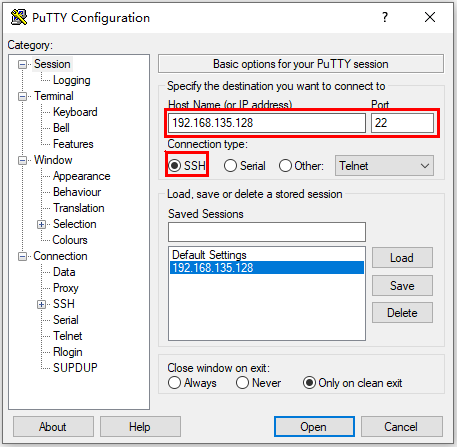

输入密码通过 ssh 登录 Ubuntu。

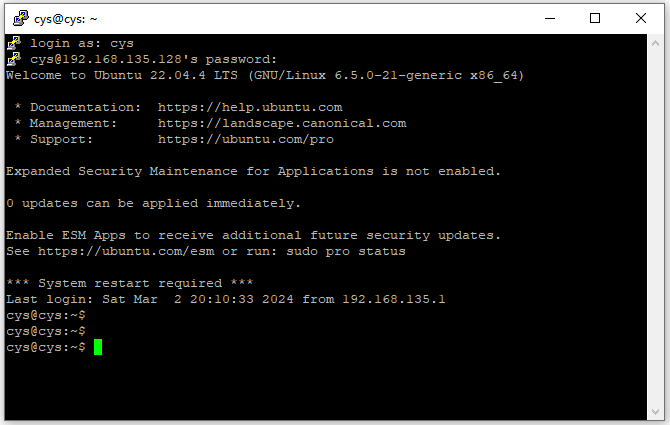


#### samba 安装与配置
1. 安装 samba
    ```shell
    $ sudo apt-get install samba
    ```

2. 配置 samba
    ```shell
    $ sudo vim /etc/samba/smb.conf
    ```
    修改配置文件，添加以下内容：
    ```shell
    [share]
        path = /home/share/samba
        available = yes
        browseable = yes
        public = no
        writable = yes
    ```

3. 重启 samba 服务
    ```shell
    $ sudo service smbd restart
    ```

4. 创建共享目录，并设置权限为可读可写可执行
    ```shell
    $ sudo mkdir -p /home/share/samba
    $ sudo chmod 777 -R /home/share/samba
    ```

5. 创建 samba 用户
    ```shell
    $ sudo smbpasswd -a username
    ```
    输入密码后，smb 用户创建完成。其中 username 为 samba 用户名根据自己的用户名输入，输入的密码为后续 Windows 下访问密码。

6. 添加网络驱动器

打开 Windows 下“文件资源管理器”，选择左侧栏中的“此电脑”，点击上方“计算机”选项卡上，选择“映射网络驱动器”。
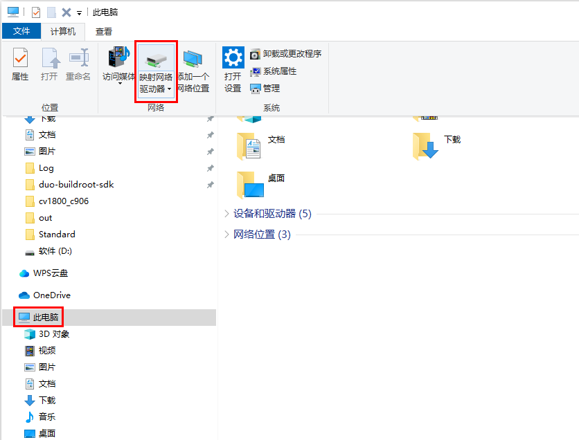

输入上诉 Ubuntu 的 ip 地址及步骤 4 中的路径，点击完成。

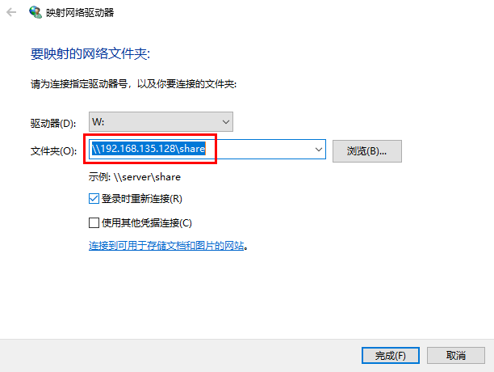

5 中的密码，并选中 “记住我的凭据”，点击确定连接即可完成网络驱动器添加。

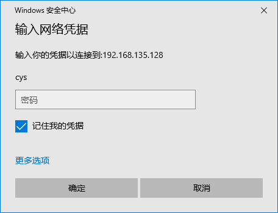

添加完成后会在“此电脑”中显示一个网络驱动器。

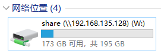

### WSL 环境搭建
WSL 即 Windows Subsystem for Linux，是 Windows 10 内置的 Linux 子系统，可运行 Linux 二进制可执行文件，并且直接调用 Linux 系统的核心库。
WSL 支持 Ubuntu、Debian、Kali Linux、Fedora 等主流 Linux 发行版。
安装 WSL 环境后，可通过 Windows 命令行工具或 PowerShell 访问 WSL 环境。
1. 打开 Windows 命令行工具，输入以下命令安装 WSL 环境。
    ```
    PowerShell wsl --install
    ```
    

2. 安装完成后，输入以下命令，启动 WSL 环境。
    ```
    PowerShell wsl
    ```

    
    
3. 输入以下命令，安装 Ubuntu 22.04。
    ```
    PowerShell wsl --install -d Ubuntu-22.04
    ```
    
    
4. 安装完成后，输入以下命令，启动 Ubuntu 22.04。
    ```
    PowerShell ubuntu
    ```

### VSCode 安装与配置
1. 安装 vscode

2. 配置 vscode ssh 远程开发
    ```shell
    $ vim ~/.ssh/config
    ```
    添加以下内容：
    ```
    Host ubuntu

3. 生成 ssh 密钥对
    ```shell
    $ ssh-keygen -t rsa
    ```

4. 将生成的公钥添加到 ssh 授权文件中
    ```shell
    $ cat /home/share/samba/id_rsa.pub > ~/.ssh/authorized_keys
    ```
    
### 编译工具安装
RT-Thread 实时操作系统采用 SCons 作为构建工具。

SCons 是一个开放源代码、以 Python 语言编写的下一代的程序建造工具，类似于 Make。它最初的名字是 ScCons, 基于由 perl 语言编写的 Cons 软件开发而成，它在 2000 年 8 月获得了由 Software Carpentry 举办的 SC 建造比赛的大奖，现在 ScCons 已经被改名为 SCons。

SCons 使用 SConscript 和 SConstruct 文件来组织源码结构并进行构建，SConstruct 是 scons 构建的主脚本，SConscript 存放在源代码的子目录下，通常放在项目的子目录，以达到分层构建的目的。一个项目 (BSP) 只有一 SConstruct，但是会有多个 SConscript。一般情况下，每个存放有源代码的子目录下都会放置一个 SConscript。

以下是一些常用的 SCons 命令：
- scons：执行 SConstruct 脚本，构建项目。如果没有指定目标，将构建默认目标。
- scons -c 或 scons --clean：清理已构建的目标。
- scons --help 或 scons -h：显示描述当前 SCons 构建环境和可用选项的帮助信息。
- scons -s 或 scons --silent：静默模式，不显示正在执行的命令。
- scons -j N：并行构建，N 是并发任务的数量，通常设置为 CPU 核心数。


使用之前需先安装 scons 及其他相关依赖工具。使用以下命令安装 scons：
```shell
$ sudo apt-get install -y scons
```

### 依赖库安装
使用以下命令安装依赖及工具：
```shell
$ sudo apt-get install -y python3 python3-pip libncurses5-dev device-tree-compiler
```

## 6.2、工程编译
### 源码下载
当前 cv1800b 大核和小核均已经支持运行 RT-Thread，大小核分别运行不同版本的 RT-Thread。
其中：
- 大核 C906 MMU：运行 RT-Smart，位于 bsp/cvitek/cv1800b 目录。
- 小核 C906 No-MMU：运行标准版 RT-Thread，位于 bsp/cvitek/c906-little 目录。

使用 git 命令下载源码：
```shell
$ git clone https://github.com/RT-Thread/rt-thread
```

### Toolchain 下载与配置
由于 cv1800b 大小核运行不同的 RT-Thread 版本，因此需要下载对应版本的 Toolchain。
1. 小核使用的是 newlib 版本的 libc 的 Toolchain，在平头哥官网 -> 开发者社区 -> 技术支持 -> 资料下载 页面 [https://www.xrvm.cn/community/download?id=4267734522939904000](https://www.xrvm.cn/community/download?id=4267734522939904000) 下载小核 Toolchain 下载。

    下载地址：[https://occ-oss-prod.oss-cn-hangzhou.aliyuncs.com/resource//1705395512373/Xuantie-900-gcc-elf-newlib-x86_64-V2.8.1-20240115.tar.gz](https://occ-oss-prod.oss-cn-hangzhou.aliyuncs.com/resource//1705395512373/Xuantie-900-gcc-elf-newlib-x86_64-V2.8.1-20240115.tar.gz)。

2. 大核使用的是 rt-thread 定制 musl 版本的 libc 的 Toolchain，在 [https://github.com/RT-Thread/toolchains-ci](https://github.com/RT-Thread/toolchains-ci) 页面下载大核 Toolchain 下载。
    下载地址：[https://github.com/RT-Thread/toolchains-ci/releases/download/v1.7/riscv64-linux-musleabi_for_x86_64-pc-linux-gnu_latest.tar.bz2](https://github.com/RT-Thread/toolchains-ci/releases/download/v1.7/riscv64-linux-musleabi_for_x86_64-pc-linux-gnu_latest.tar.bz2)。

3. 可使用 wget 下载对应 Toolchain，解压下载的 Toolchain 压缩包。
    ```shell
    $ wget https://occ-oss-prod.oss-cn-hangzhou.aliyuncs.com/resource//1705395512373/Xuantie-900-gcc-elf-newlib-x86_64-V2.8.1-20240115.tar.gz
    $ sudo tar -zxvf Xuantie-900-gcc-elf-newlib-x86_64-V2.8.1-20240115.tar.gz -C /opt
    $ wget https://github.com/RT-Thread/toolchains-ci/releases/download/v1.7/riscv64-linux-musleabi_for_x86_64-pc-linux-gnu_latest.tar.bz2
    $ sudo tar -jxvf riscv64-linux-musleabi_for_x86_64-pc-linux-gnu_latest.tar.bz2 -C /opt
    ```

4. 配置 Toolchain
可通过修改项目工程下的 rtconfig.py 文件来配置 Toolchain 路径。分别修改 `bsp/cvitek/c906-little/rtconfig.py` 和 `bsp/cvitek/c1800b/rtconfig.py` 文件指定上诉 Toolchain 路径。

- 小核 c906-little 的交叉编译工具链路径为：`/opt/Xuantie-900-gcc-elf-newlib-x86_64-V2.8.1-20240115/bin`
    ```python
    if  CROSS_TOOL == 'gcc':
        PLATFORM    = 'gcc'
        EXEC_PATH   = r'/opt/Xuantie-900-gcc-elf-newlib-x86_64-V2.8.0/bin'
    ```

- 大核 cv1800b 交叉编译工具链路径为：`/opt/riscv64-linux-musleabi_for_x86_64-pc-linux-gnu/bin`
    ```python
    if  CROSS_TOOL == 'gcc':
        PLATFORM    = 'gcc'
        EXEC_PATH   = r'/opt/riscv64-linux-musleabi_for_x86_64-pc-linux-gnu/bin'
    ```

另外也可以通过 `RTT_EXEC_PATH` 环境变量指定路径。

使用如下方式指定路径：

- 大核：
    ```shell
    $ export RTT_EXEC_PATH=/opt/riscv64-linux-musleabi_for_x86_64-pc-linux-gnu/bin
    ```

- 小核：
    ```shell
    $ export RTT_EXEC_PATH=/opt/Xuantie-900-gcc-elf-newlib-x86_64-V2.8.1/bin
    ```

### 编译
cv1800b 大小核需要分别编译，分别进入对应目录进行编译。

1. 编译小核
    ```shell
    $ cd bsp/cvitek/c906-little
    $ scons -j8
    # 采用指定交叉编译工具链的方式编译
    $ scons --exec-path=/opt/Xuantie-900-gcc-elf-newlib-x86_64-V2.8.1/bin
    ```


2. 编译大核
    ```shell
    $ cd bsp/cvitek/c906-little
    $ scons -j8
    # 采用指定交叉编译工具链的方式编译
    $ scons --exec-path=/opt/riscv64-linux-musleabi_for_x86_64-pc-linux-gnu/bin
    ```


编译完成后，会自动调用相关脚本在 bsp/cvitek 目录下合成 fip.bin 和 sd.boot 文件。
其中：
- fip.bin：fsbl、 opensbi、 uboot、c906_little 打包后的 bin 文件
- boot.sd：大核打包后的 bin 文件

> 注：
> 1. 由于 RT-Thread 一直在快速迭代中，如更新代码后无法编译，请尝试使用运行 `scons --menuconfig` 命令，然后保存新配置后，重新编译。
> 2. 并行编译参数可根据自己的计算机 CPU 情况自行修改。
> 3. 可在编译中加入 `--verbose` 参数在编译过程中输出详细的编译信息。

### 配置
menuconfig 是一种图形化配置工具，是 RT-Thread 3.0 以上版本的特性，可对内核、组件和软件包进行自由裁剪，使系统以搭积木的方式进行构建。

如需配置裁剪RT-Thread，在当前需要配置的工程目录下输入以下命令，进入配置页面：
```shell
$ scons --menuconfig
```

配置完成并保存配置后，会在工程目录下生成 `rtconfig.h` 文件。

menuconfig 命令会自动下载 env 相关脚本到 `~/.env` 目录。如需要下载软件包，执行以下命令下载：
```shell
$ source ~/.env/env.sh
$ pkgs --update
```

### 运行

1. 将 SD 卡分为 2 个分区，第 1 个分区用于存放 bin 文件，第 2 个分区用于作为数据存储分区，分区格式为 `FAT32`。
2. 将根目录下的 `fip.bin` 和 `boot.sd` 复制 SD 卡第一个分区中。后续更新固件只需要复制 `fip.sd` 文件即可。
3. 将 SD 卡插入开发板，将开发板连接到 PC，通过串口工具（如：PuTTY、SecureCRT、Xshell 等）连接到串口，波特率设置为 115200。
其中：
    - 大核默认日志串口为 uart0，其中 TX 对应开发板 GP12（PIN16），RX 对应开发板 GP13（PIN17）。
    - 小核默认日志串口为 uart1，其中 TX 对应开发板 GP0（PIN1），RX 对应开发板 GP1（PIN2）。

4. 开发板上电后，大小核分别运行，从上诉对应的串口输出日志。
    - 大核运行日志:
    ```shell
    U-Boot 2021.10 (Jun 26 2023 - 14:09:06 +0800)cvitek_cv180x

    DRAM:  63.3 MiB
    gd->relocaddr=0x82435000. offset=0x2235000
    MMC:   cv-sd@4310000: 0
    Loading Environment from <NULL>... OK
    In:    serial
    Out:   serial
    Err:   serial
    Net:   
    Warning: ethernet@4070000 (eth0) using random MAC address - 62:80:19:6c:d4:64
    eth0: ethernet@4070000
    Hit any key to stop autoboot:  0 
    Boot from SD ...
    switch to partitions #0, OK
    mmc0 is current device
    132692 bytes read in 12 ms (10.5 MiB/s)
    ## Loading kernel from FIT Image at 81400000 ...
    Using 'config-cv1800b_milkv_duo_sd' configuration
    Trying 'kernel-1' kernel subimage
    Verifying Hash Integrity ... crc32+ OK
    ## Loading fdt from FIT Image at 81400000 ...
    Using 'config-cv1800b_milkv_duo_sd' configuration
    Trying 'fdt-cv1800b_milkv_duo_sd' fdt subimage
    Verifying Hash Integrity ... sha256+ OK
    Booting using the fdt blob at 0x8141b590
    Uncompressing Kernel Image
    Decompressing 296768 bytes used 42ms
    Loading Device Tree to 0000000081be5000, end 0000000081becb60 ... OK

    Starting kernel ...

    heap: [0x802766b0 - 0x812766b0]

    \ | /
    - RT -     Thread Smart Operating System
    / | \     5.0.1 build Jun 28 2023 23:44:36
    2006 - 2022 Copyright by RT-Thread team
    Hello RT-Smart!
    msh />
    ```

    - 小核运行日志:
    ```shell
    HW_HEAP_BEGIN:83f74dc0 RT_HW_HEAP_END:84000000 size: 569920

    \ | /
    - RT -     Thread Operating System
    / | \     5.1.0 build Jan 27 2024 22:45:49
    2006 - 2022 Copyright by RT-Thread team
    Hello, RISC-V!
    msh />
    ```

## 6.3、FAQ 
1. 缺少 libssl.so.1.1

错误日志如下：
```shell
./mkimage: error while loading shared libraries: libssl.so.1.1: cannot open shared object file: No such file or directory
```
原因：
libssl1.1 自 ubuntu18.04 之后就从仓库中移除了，因此在使用 Ubuntu22.04 时，无论如何 sudo apt update 也无法安装和更新 libss1.1，所以如果某些软件仍依赖这个库导致无法正常运行，我们需手动安装该库。

可在 [http://security.ubuntu.com/ubuntu/pool/main/o/openssl](http://security.ubuntu.com/ubuntu/pool/main/o/openssl) 下载 `libssl1.1_1.1.1f-1ubuntu2_amd64.deb` 文件后安装即可解决。

可通过以下命令下载安装：
```shell
$ wget http://security.ubuntu.com/ubuntu/pool/main/o/openssl/libssl1.1_1.1.1f-1ubuntu2_amd64.deb
$ sudo dpkg -i libssl1.1_1.1.1f-1ubuntu2_amd64.deb
```
如发现 wget 下载失败，可能是因为包已经更新需要手工下载。