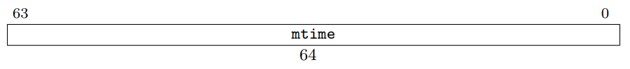
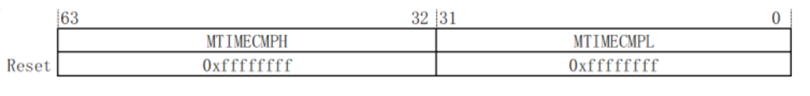

7、CV1800B小核移植
==================

CV1800B 中的小核是比较特殊的 RISC-V 64 位 无 MMU 的平头哥
C906，应该是为了节省成本将 MMU 裁剪掉了。

本文通过循序渐进的方式一步一步完成适配 RT-Thread，本章节相关工作均在 bsp
目录下对应的项目工程目录下进行。

7.1、相关寄存器
---------------

1. MIE
2. MTVEC

7.2、第一阶段：bsp工程创建与编译
--------------------------------

第一阶段目标：可以正常编译 RT-Thread，生成 rtthread.bin
后通过脚本合并生成可运行的 bin 文件。

bsp 目录
~~~~~~~~

包括： 1. 链接脚本： 复制
duo-buildroot-sdk/freertos/cvitek/scripts/cv180x_lscript.ld 及
build/output/cv1800b_milkv_duo_sd/cvi_board_memmap.ld。

2. 在项目根据路下添加 Kconfig 文件: 由于 cv 1800b 小核是 c906-nommu，在
   Kconfig 文件中必须添加以下配置：
   ``shell     config BSP_USING_C906_LITTLE         bool         select ARCH_RISCV64         select ARCH_RISCV_FPU_D         select RT_USING_COMPONENTS_INIT         select RT_USING_USER_MAIN         default y``

3. 添加 scons 编译文件 SConscript 和 SConstruct。

4. 建立 board 目录，复制 freertos/cvitek/arch/riscv64 目录，并修改
   start.S 文件中硬件初始化完成后跳转到 RT-Thread 内置 C 语言的入口函数
   ``entry``\ 。 \```s #include “riscv-virt.h” .org 0 .section .vectors,
   “ax” .globl \_start .type \_start,@function \_start: .cfi_startproc
   .cfi_undefined ra .option push .option norelax // la gp,
   \__global_pointer$ .option pop

   ::

       // Continue primary hart
       csrr a0, mhartid
       li   a1, PRIM_HART
       bne  a0, a1, secondary

       li x1, 0
       li x2, 0
       li x3, 0
       li x4, 0
       li x5, 0
       li x6, 0
       li x7, 0
       li x8, 0
       li x9, 0
       li x10, 0
       li x11, 0
       li x12, 0
       li x13, 0
       li x14, 0
       li x15, 0
       li x16, 0
       li x17, 0
       li x18, 0
       li x19, 0
       li x20, 0
       li x21, 0
       li x22, 0
       li x23, 0
       li x24, 0
       li x25, 0
       li x26, 0
       li x27, 0
       li x28, 0
       li x29, 0
       li x30, 0
       li x31, 0

       // enable interrupt

   // li x3, 0x880 // csrw mie, x3

   ::

       csrw mie, 0
       csrw mip, 0
       la t0, trap_entry
       csrw mtvec, t0

   #ifndef RISCV_QEMU // invalidate all memory for BTB,BHT,DCACHE,ICACHE
   li x3, 0x30013 csrs mcor, x3 // enable ICACHE,DCACHE,BHT,BTB,RAS,WA
   li x3, 0x7f csrs mhcr, x3 // enable data_cache_prefetch, amr li x3,
   0x610c csrs mhint, x3 #mhint #endif # enable fp li x3, 0x1 << 13 csrs
   mstatus, x3

   ::

       // Primary hart
       la sp, _stack_top

       // Load data section
       la a0, _data_lma
       la a1, _data
       la a2, _edata
       bgeu a1, a2, 2f

   1: LOAD t0, (a0) STOR t0, (a1) addi a0, a0, REGSIZE addi a1, a1,
   REGSIZE bltu a1, a2, 1b 2:

   ::

       // Clear bss section
       la a0, _bss
       la a1, _ebss
       bgeu a0, a1, 2f

   1: // reduce branch time, be sure about bss alignment in linker
   script STOR zero, 0x00 (a0) STOR zero, 0x08 (a0) STOR zero, 0x10 (a0)
   STOR zero, 0x18 (a0) STOR zero, 0x20 (a0) STOR zero, 0x28 (a0) STOR
   zero, 0x30 (a0) STOR zero, 0x38 (a0) addi a0, a0, REGSIZE \* 8 bltu
   a0, a1, 1b 2:

   ::

       // argc, argv, envp is 0
       li  a0, 0
       li  a1, 0
       li  a2, 0
       jal entry

   1: wfi j 1b

   secondary: // TODO: Multicore is not supported wfi j secondary
   .cfi_endproc \``\`

5. 修改 rtconfig.py 中的编译参数，相关参数参考
   freertos/cvitek/scripts/toolchain-riscv64-elf.cmake 文件。

   .. code:: python

      import os

      # toolchains options
      ARCH        ='risc-v'
      CPU         ='rv64'
      CROSS_TOOL  ='gcc'

      # bsp lib config
      BSP_LIBRARY_TYPE = None

      if os.getenv('RTT_ROOT'):
          RTT_ROOT = os.getenv('RTT_ROOT')
      else:
          RTT_ROOT = r'../../..'

      if os.getenv('RTT_CC'):
          CROSS_TOOL = os.getenv('RTT_CC')

      if  CROSS_TOOL == 'gcc':
          PLATFORM    = 'gcc'
          EXEC_PATH   = r'/opt/Xuantie-900-gcc-elf-newlib-x86_64-V2.8.1/bin'
      else:
          print('Please make sure your toolchains is GNU GCC!')
          exit(0)

      if os.getenv('RTT_EXEC_PATH'):
          EXEC_PATH = os.getenv('RTT_EXEC_PATH')

      BUILD = 'debug'

      if PLATFORM == 'gcc':
          # toolchains
          PREFIX  = 'riscv64-unknown-elf-'
          CC      = PREFIX + 'gcc'
          CXX     = PREFIX + 'g++'
          AS      = PREFIX + 'gcc'
          AR      = PREFIX + 'ar'
          LINK    = PREFIX + 'gcc'
          TARGET_EXT = 'elf'
          SIZE    = PREFIX + 'size'
          OBJDUMP = PREFIX + 'objdump'
          OBJCPY  = PREFIX + 'objcopy'

          DEVICE  = ' -march=rv64imafdc -mabi=lp64d -mcmodel=medany'
          CFLAGS  = DEVICE + ' -std=gnu11 -ffunction-sections -fdata-sections -Wl,--gc-sections -Wno-pointer-to-int-cast -fno-builtin -Wno-missing-field-initializers -fdiagnostics-color=always' 
          CFLAGS += ' -Wall -nostdlib'
          CFLAGS += ' -DCONFIG_64BIT'

          LINKER_SCRIPTS = r'cv180x_lscript.ld'

          AFLAGS  = ' -c' + DEVICE + ' -x assembler-with-cpp'
          LFLAGS  = DEVICE + ' -nostartfiles -fms-extensions -ffunction-sections -fdata-sections -Wl,--gc-sections,-Map=rtthread.map,-cref,-u,_start -T ' + LINKER_SCRIPTS
          CPATH   = ''
          LPATH   = ''

          if BUILD == 'debug':
              CFLAGS += ' -O2 -g'
              AFLAGS += ' -g'
          else:
              CFLAGS += ' -O3'

          CXXFLAGS = CFLAGS + ' -std=gnu++17 -Wno-multichar -Wno-parentheses'

      DUMP_ACTION = OBJDUMP + ' -D -S $TARGET > rtt.asm\n'
      POST_ACTION = OBJCPY + ' -O binary $TARGET rtthread.bin\n' + SIZE + ' $TARGET \n'
      POST_ACTION += 'cd .. && ./combine-fip.sh c906_little/rtthread.bin\n'

6. 添加 application 目录，并创建 main.c 文件，添加 main
   函数，不然编译会报错。

   .. code:: c

      #include <rtthread.h>
      #include <stdio.h>

      int main(void)
      {
          rt_kprintf("Hello, RISC-V!\n");

          return 0;
      }

drivers 目录
~~~~~~~~~~~~

1. 创建 drivers 目录，添加 board.c 、board.h，在 board.c 中实现
   ``rt_hw_board_init()`` 函数，该文件在 ``rtthread_startup()``
   函数中被调用。并需在该函数中先实现串口初始化及 ``rt_console``
   设备注册，用于日志输出。

.. code:: c

   void rt_hw_board_init(void)
   {
   #ifdef RT_USING_SERIAL
       rt_hw_uart_init();
   #endif

       /* Set the shell console output device */
   #if defined(RT_USING_CONSOLE) && defined(RT_USING_DEVICE)
       rt_console_set_device(RT_CONSOLE_DEVICE_NAME);
   #endif

   #ifdef RT_USING_COMPONENTS_INIT
       rt_components_board_init();
   #endif      
   }

串口驱动
~~~~~~~~

1. 串口驱动适配 参考 `驱动框架与适配 <9.md>`__ 完成串口驱动适配。

2. 进入 menuconfig，配置 console 串口设备。在 RT-Thread Kernel
   菜单下配置。

   -  选中 ``Using console for rt_kprintf``\ ，默认已选中。
   -  将 ``the device name for console``
      名字修改为与上诉驱动名一致，当前配置为 ``uart0``\ 。
   -  可以修改 ``the buffer size for console log printf`` 值，默认为
      ``128``\ ，可能会影响某些特别长的打印正常显示，可根据当前芯片内存情况修改为
      ``256`` 或 ``512``\ 。

   .. code:: shell

      $ scons --menuconfig
          RT-Thread Kernel  --->
              [*] Using console for rt_kprintf
              (512) the buffer size for console log printf
              (uart0) the device name for console 

堆栈配置
~~~~~~~~

1. 查看 ld 文件，获取到内存 section 分布情况。
   ``c     MEMORY     {     psu_ddr_0_MEM_0 : ORIGIN = CVIMMAP_FREERTOS_ADDR , LENGTH = CVIMMAP_FREERTOS_SIZE     }``
   CVIMMAP_FREERTOS_ADDR 和 CVIMMAP_FREERTOS_SIZE 定义在
   cvi_board_memmap.ld 文件中，该文件在原厂 SDK
   是自动生成的，这里我们用的是自动生成完成后的文件。

   .. code:: c

      CVIMMAP_FREERTOS_ADDR = 0x83f40000;
      CVIMMAP_FREERTOS_RESERVED_ION_SIZE = 0x0;
      CVIMMAP_FREERTOS_SIZE = 0xc0000;

   代码和数据都放在 RAM 上运行， 地址为 ``0x83f40000: 0x84000000`` 总共
   ``0xc0000`` 字节。

2. stack 设置

   修改 ld 文件，添加 \__rt_rvstack 为栈顶地址。
   ``shell  /* Generate Stack and Heap definitions */  .stack (NOLOAD) : {  . = ALIGN(64);  _stack_end_end = .;  . += _STACK_SIZE;  _stack_top = .;  __rt_rvstack = .;   } > psu_ddr_0_MEM_0``

3. heap 设置

   我们将程序运行空间、全局变量、栈空间等之外所有剩余的空间都作为 heap
   使用，并会根据程序/数据的大小自动动态调整。

   -  修改 ld 文件。原 ld 文件中 heap 定义在 stack 前，FreeRTOS 的 heap
      是通过全局数据来定义的属于 .bss 段，所以定义没有问题。在适配
      RT-Thread 时需要做一定的修改，将 stack 放在 heap
      前面，并将所有的剩余空间都作为 heap 使用。

   .. code:: c

      /* Generate Stack and Heap definitions */
      .stack (NOLOAD) : {
      . = ALIGN(64);
      _stack_end_end = .;
      . += _STACK_SIZE;
      _stack_top = .;
      __rt_rvstack = .; 
      } > psu_ddr_0_MEM_0

      .heap (NOLOAD) : {
      . = ALIGN(64);
      _heap = .;
      HeapBase = .;
      _heap_start = .;
      *(.heap*)
      /*. += _HEAP_SIZE;*/
      /*_heap_size = _HEAP_SIZE; */
      _heap_end = .;
      HeapLimit = .;
      } > psu_ddr_0_MEM_0

      HeapLimit = ORIGIN(psu_ddr_0_MEM_0) + LENGTH(psu_ddr_0_MEM_0);
      _end = .;

   -  修改 board.h，添加 heap 的起、始地址。

   .. code:: c

      extern rt_uint8_t HeapBase;
      extern rt_uint8_t HeapLimit;

      #define RT_HW_HEAP_BEGIN    (void *)&HeapBase
      #define RT_HW_HEAP_END      (void *)&HeapLimit

   -  修改 board.c 在 ``rt_hw_board_init()`` 函数最前面加入 heap
      初始化代码。

   .. code:: c

      #ifdef RT_USING_HEAP
          /* initialize memory system */
          rt_system_heap_init(RT_HW_HEAP_BEGIN, RT_HW_HEAP_END);
      #endif

7.4、第二阶段：文件打包
-----------------------

第二阶段目标：将第一阶段生成的 bin
文件与其他相关的文件合并，生成芯片需要的相关文件后可以正常启动运行，可以在启动后显示
RT-Thread 启动 LOG。

根据前文分析，cv1800b 小核生成的文件是打包在 fip.bin 文件内的，fip.bin
由 BL2、opensbi、uboot、小核 bin
文件等工作合并而成。将需要的相关文件和打包脚本整合进入 RT-Thread bsp
工程，打包脚本命名为 combine.sh。

将上诉生成的 rtthread.bin 文件通过 combine.sh 脚本和 BL2、opensbi、uboot
合并生成 fip.bin，更新至 SD 卡，即可正常运行。

完成以上工作后，可以在串口中看到如下启动日志：

.. code:: shell

    \ | /
   - RT -     Thread Operating System
    / | \     5.1.0 build Dec 18 2023 17:29:19
    2006 - 2022 Copyright by RT-Thread team

RT-Thread
已经启动起来了，但是由于对中断相关工作进行配置处理，所以调度器不能正常运行，其实是处于裸机工作状态。

7.5、第三阶段：中断
-------------------

我们知道操作系统是需要靠硬件定时器定时中断做任务调度的，所以中断是移植
RT-Thread 最重要的工作之一。

中断初始化
~~~~~~~~~~

在原 start.S 文件中，启动函数 ``_start`` 中通过配置 MIE
寄存器使能相关中断。

.. code:: s

       // enable interrupt
   //  li x3, 0x880
   //  csrw mie, x3

其中： - MEIE = 1：使能机器模式外部中断使能位 - MTIE =
1：使能机器模式定时器中断

在 RT-Thread 中 MEIE 和 MTIE
中断使能均在对应模块中使能，这部分代码可以注释。

然后将中断和异常统一处理函数 ``trap_entry()`` 设置至 MTVEC
机器模式向量基址寄存器。

.. code:: s

       csrw mie, 0
       csrw mip, 0
       la t0, trap_entry
       csrw mtvec, t0

MTVEC 寄存器 bit[1:0] 为 向量入口模式位 MODE，当 MODE[1:0] 为 2’ b00
时，异常和中断都统一使用 BASE 地址作为异常入口地址，BASE 即为
``trap_entry()`` 的函数地址。

当异常/中断触发后，CPU 就会将跳转至 ``trap_entry()`` 函数处执行。

中断与异常处理
~~~~~~~~~~~~~~

``trap_entry()`` 函数位于 ``libcpu/risc-v/common/interrupt_gcc.S``
文件。

.. code:: s

     .section      .text.trap_entry
     .align 2
     .global trap_entry
   trap_entry:
   #ifdef ARCH_RISCV_FPU
       addi    sp, sp, -32 * FREGBYTES

       FSTORE  f0, 0 * FREGBYTES(sp)
       FSTORE  f1, 1 * FREGBYTES(sp)
       FSTORE  f2, 2 * FREGBYTES(sp)
       FSTORE  f3, 3 * FREGBYTES(sp)
       FSTORE  f4, 4 * FREGBYTES(sp)
       FSTORE  f5, 5 * FREGBYTES(sp)
       FSTORE  f6, 6 * FREGBYTES(sp)
       FSTORE  f7, 7 * FREGBYTES(sp)
       FSTORE  f8, 8 * FREGBYTES(sp)
       FSTORE  f9, 9 * FREGBYTES(sp)
       FSTORE  f10, 10 * FREGBYTES(sp)
       FSTORE  f11, 11 * FREGBYTES(sp)
       FSTORE  f12, 12 * FREGBYTES(sp)
       FSTORE  f13, 13 * FREGBYTES(sp)
       FSTORE  f14, 14 * FREGBYTES(sp)
       FSTORE  f15, 15 * FREGBYTES(sp)
       FSTORE  f16, 16 * FREGBYTES(sp)
       FSTORE  f17, 17 * FREGBYTES(sp)
       FSTORE  f18, 18 * FREGBYTES(sp)
       FSTORE  f19, 19 * FREGBYTES(sp)
       FSTORE  f20, 20 * FREGBYTES(sp)
       FSTORE  f21, 21 * FREGBYTES(sp)
       FSTORE  f22, 22 * FREGBYTES(sp)
       FSTORE  f23, 23 * FREGBYTES(sp)
       FSTORE  f24, 24 * FREGBYTES(sp)
       FSTORE  f25, 25 * FREGBYTES(sp)
       FSTORE  f26, 26 * FREGBYTES(sp)
       FSTORE  f27, 27 * FREGBYTES(sp)
       FSTORE  f28, 28 * FREGBYTES(sp)
       FSTORE  f29, 29 * FREGBYTES(sp)
       FSTORE  f30, 30 * FREGBYTES(sp)
       FSTORE  f31, 31 * FREGBYTES(sp)

   #endif

       /* save thread context to thread stack */
   #ifndef __riscv_32e
       addi sp, sp, -32 * REGBYTES
   #else
       addi sp, sp, -16 * REGBYTES
   #endif
       STORE x1,   1 * REGBYTES(sp)

       csrr  x1, mstatus
       STORE x1,   2 * REGBYTES(sp)

       csrr  x1, mepc
       STORE x1, 0 * REGBYTES(sp)

       STORE x4,   4 * REGBYTES(sp)
       STORE x5,   5 * REGBYTES(sp)
       STORE x6,   6 * REGBYTES(sp)
       STORE x7,   7 * REGBYTES(sp)
       STORE x8,   8 * REGBYTES(sp)
       STORE x9,   9 * REGBYTES(sp)
       STORE x10, 10 * REGBYTES(sp)
       STORE x11, 11 * REGBYTES(sp)
       STORE x12, 12 * REGBYTES(sp)
       STORE x13, 13 * REGBYTES(sp)
       STORE x14, 14 * REGBYTES(sp)
       STORE x15, 15 * REGBYTES(sp)
   #ifndef __riscv_32e
       STORE x16, 16 * REGBYTES(sp)
       STORE x17, 17 * REGBYTES(sp)
       STORE x18, 18 * REGBYTES(sp)
       STORE x19, 19 * REGBYTES(sp)
       STORE x20, 20 * REGBYTES(sp)
       STORE x21, 21 * REGBYTES(sp)
       STORE x22, 22 * REGBYTES(sp)
       STORE x23, 23 * REGBYTES(sp)
       STORE x24, 24 * REGBYTES(sp)
       STORE x25, 25 * REGBYTES(sp)
       STORE x26, 26 * REGBYTES(sp)
       STORE x27, 27 * REGBYTES(sp)
       STORE x28, 28 * REGBYTES(sp)
       STORE x29, 29 * REGBYTES(sp)
       STORE x30, 30 * REGBYTES(sp)
       STORE x31, 31 * REGBYTES(sp)
   #endif

       /* switch to interrupt stack */
       move  s0, sp

   #ifdef RT_USING_SMP
       /* get cpu id */
       csrr  t0, mhartid

       /* switch interrupt stack of current cpu */
       la    sp, __stack_start__
       addi  t1, t0, 1
       li    t2, __STACKSIZE__
       mul   t1, t1, t2
       add   sp, sp, t1 /* sp = (cpuid + 1) * __STACKSIZE__ + __stack_start__ */
   #endif

       /* handle interrupt */
       call  rt_interrupt_enter
       csrr  a0, mcause
       csrr  a1, mepc
       mv    a2, s0
       call  handle_trap
       call  rt_interrupt_leave

   #ifdef RT_USING_SMP
       /* s0 --> sp */
       mv  sp, s0
       mv  a0, s0
       call rt_scheduler_do_irq_switch
       tail   rt_hw_context_switch_exit

   #else

       /* switch to from_thread stack */
       move  sp, s0

       /* need to switch new thread */
       la    s0, rt_thread_switch_interrupt_flag
       lw    s2, 0(s0)
       beqz  s2, spurious_interrupt
       sw    zero, 0(s0)

       la    s0, rt_interrupt_from_thread
       LOAD  s1, 0(s0)
       STORE sp, 0(s1)

       la    s0, rt_interrupt_to_thread
       LOAD  s1, 0(s0)
       LOAD  sp, 0(s1)

   #endif

   spurious_interrupt:
       tail rt_hw_context_switch_exit

RISC-V
架构规定，进入异常和退出异常中没有硬件自动保存和恢复上下文的操作，因此需要软件明确地使用指令进行上下文的保存和恢复。

所以 trap_entry() 函数完成以下工作： 1. 保存现场， 2. 调用 RT-Thread
所有中断处理函数都需要调用的 ``rt_interrupt_enter();`` 通知系统进入中断
3. 调用真正的 trap 处理函数 ``handle_trap()`` 函数处理trap，并将
MCAUSE，MEPC，SP 这 3 个寄存器通过a0/a1/a2 寄存器转至 ``handle_trap()``
函数。 4. 调用 ``rt_interrupt_leave();`` 通知系统离开中断 5.
判断是否有更高优先级的任务需要调度（rt_thread_switch_interrupt_flag标志），有则进行任务切换
6. 调用 rt_hw_context_switch_exit 恢复现场。

``handle_trap()`` 函数位于\ ``libcpu/risc-v/rv64/trap.c`` 文件。

.. code:: c

   rt_weak rt_size_t handle_trap(rt_size_t cause, rt_size_t epc, rt_size_t *sp)
   {
       if (cause & (1UL << (__riscv_xlen - 1)))          //interrupt
       {
           if ((cause & 0x1f) == IRQ_M_SOFT)
           {
               rt_hw_soft_irq_isr();
           }
           else if ((cause & 0x1f) == IRQ_M_TIMER)
           {
               rt_hw_tick_isr();
           }
           else if ((cause & 0x1f) == IRQ_M_EXT)
           {
               rt_hw_irq_isr();
           }
       }
       else
       {
           rt_thread_t tid;
   #if defined(RT_USING_FINSH) && defined(MSH_USING_BUILT_IN_COMMANDS)
           extern long list_thread();
   #endif

           rt_hw_interrupt_disable();

           tid = rt_thread_self();
           rt_kprintf("\nException:\n");
           switch (cause)
           {
               case CAUSE_MISALIGNED_FETCH:
                   rt_kprintf("Instruction address misaligned");
                   break;
               case CAUSE_FAULT_FETCH:
                   rt_kprintf("Instruction access fault");
                   break;
               case CAUSE_ILLEGAL_INSTRUCTION:
                   rt_kprintf("Illegal instruction");
                   break;
               case CAUSE_BREAKPOINT:
                   rt_kprintf("Breakpoint");
                   break;
               case CAUSE_MISALIGNED_LOAD:
                   rt_kprintf("Load address misaligned");
                   break;
               case CAUSE_FAULT_LOAD:
                   rt_kprintf("Load access fault");
                   break;
               case CAUSE_MISALIGNED_STORE:
                   rt_kprintf("Store address misaligned");
                   break;
               case CAUSE_FAULT_STORE:
                   rt_kprintf("Store access fault");
                   break;
               case CAUSE_USER_ECALL:
                   rt_kprintf("Environment call from U-mode");
                   break;
               case CAUSE_SUPERVISOR_ECALL:
                   rt_kprintf("Environment call from S-mode");
                   break;
               case CAUSE_HYPERVISOR_ECALL:
                   rt_kprintf("Environment call from H-mode");
                   break;
               case CAUSE_MACHINE_ECALL:
                   rt_kprintf("Environment call from M-mode");
                   break;
               default:
                   rt_kprintf("Uknown exception : %08lX", cause);
                   break;
           }
           rt_kprintf("\n");
           print_stack_frame(sp);
           rt_kprintf("exception pc => 0x%08x\n", epc);
           rt_kprintf("current thread: %.*s\n", RT_NAME_MAX, tid->parent.name);
   #if defined(RT_USING_FINSH) && defined(MSH_USING_BUILT_IN_COMMANDS)
           list_thread();
   #endif
           while(1);
       }

       return epc;
   }

主要完成以下工作： 1. 判断 MCAUSE
最高位是否被置位，置位则表示当前位中断，否则为异常 2. 如当前为中断则判断
MCASUE 的
bit[4:0]，通过判断异常向量表对应的中断号，跳转置对应的系统计时器、外部中断、软件中断函数处理。
3. 如当前为异常，则通过异常号做对应处理

中断配置
~~~~~~~~

CV1800B 小核是
C906-NOMMU，所以只能工作在机器模式下，超级用户模式下的中断都作为异常处理。
涉及到的中断有 3 种： - 定时器中断 - 外部中断 - 软件中断

1. 定时器中断

   定时器中断配置是在 ``board/board.c`` 文件中 ``rt_hw_board_init()``
   函数中完成初始化。

   在 board/board.c 文件中 ``rt_hw_board_init()``
   函数中添加硬件定时器初始化函数 ``rt_hw_tick_init()``\ 。

2. 外部中断

   外部中断配置是在 ``board/board.c`` 文件中 ``rt_hw_board_init()``
   函数中完成初始化。

   在 board/board.c 文件中 ``rt_hw_board_init()`` 函数中添加
   负责外部\ ``rt_hw_interrupt_init()``\ 。

3. 软件中断主要用于线程切换，RT-Thread 在线程切换中未使用软件中断。

完成后的 ``rt_hw_board_init()`` 函数如下：

.. code:: c

   void rt_hw_board_init(void)
   {
   #ifdef RT_USING_HEAP
       /* initialize memory system */
       rt_system_heap_init(RT_HW_HEAP_BEGIN, RT_HW_HEAP_END);
   #endif

       /* initalize interrupt */
       rt_hw_interrupt_init();

       /* init rtthread hardware */
       rt_hw_tick_init();

   #ifdef RT_USING_SERIAL
       rt_hw_uart_init();
   #endif

       /* Set the shell console output device */
   #if defined(RT_USING_CONSOLE) && defined(RT_USING_DEVICE)
       rt_console_set_device(RT_CONSOLE_DEVICE_NAME);
   #endif

   #ifdef RT_USING_COMPONENTS_INIT
       rt_components_board_init();
   #endif

   #ifdef RT_USING_HEAP
       /* initialize memory system */
       rt_kprintf("RT_HW_HEAP_BEGIN:%x RT_HW_HEAP_END:%x size: %d\r\n", RT_HW_HEAP_BEGIN, RT_HW_HEAP_END, RT_HW_HEAP_END - RT_HW_HEAP_BEGIN);
   #endif

   }

系统计时器
~~~~~~~~~~

按照 RISC-V 定义，RV32 和 RV64 均需要提供一个 64 位系统定时器
MTIME，该定时器在处理器核局部中断控制器（Core Local Interruptor 简称
CLINT）中实现。

系统计时器定义了两个 64 位宽的寄存器 MTIME 和 MTIMECMP：

1. MTIME
   是一个可读可写的计数器，其中的数值以一定的时间间隔递增，计数器计满后会回绕。



   MTIME

2. 一个机器模式计时器比较寄存器（MTIMECMPH，MTIMECMPL）和一个 64
   位的超级用户模式计时器比较寄存器（STIMECMPH，STIMECMPL）。



   MTIMECMP

通过比较系统计时器的当前值（MTIME）与比较值寄存器（MTIMECMP/STIMECMP）的值来确定是否产生计时器中断。
- 当系统计时器的值小于比较寄存器（MTIMECMP/STIMECMP）的值时不产生中断。
-
当系统计时器的值大于等于比较寄存器（MTIMECMP/STIMECMP）的值时产生对应的计时器中断。

在机器模式下，只有当 MTIMECMP 寄存器被重新写入后，MIP
寄存器中的时钟中断标志位才会被清除。

机器模式下可以访问/修改所有计时器中断相关的寄存器；带超级用户模式的架构超级用户模式下只具有访问/修改超级用户模式计时器比较寄存器的权限。

RISC-V 特权 ISA 规范
https://github.com/riscv/riscv-isa-manual/releases/download/riscv-isa-release-056b6ff-2023-10-02/riscv-privileged.pdf
中 3.2.1 Machine Timer Registers (mtime and mtimecmp)
中可以找到系统计时器的规范。

在 RISC-V 规范中并没有定义 MTIME 寄存器和 MTIMECMP/STIMECMP 寄存器为 CSR
寄存器，而是定义其为存储器地址映射（Machine-Level Memory-Mapped
Registers）的系统寄存器，具体的存储器音声地址 RISC-V 架构没有规定，是有
SOC 设计厂商自己定义的。

MTIME 和 MTIMECMP 无论是 RV32E、RV32I、RV64、RV128 总是 64
位的。对用作计数的这两个寄存器而言，64
位已经是天文数字，在产品的整个生命周期内都不会产生溢出。假设驱动 MTIME
的时钟频率是 10GHz（目前还没有哪个CPU主频能到 10GHz 的吧），那么要让 64
位的 MTIME 溢出，那么需要 0x10000000000000000 / 10000000000 / 60 / 60 /
24 / 365 年，也就是 58 年。

C906中的系统计时器
^^^^^^^^^^^^^^^^^^

在 C906 中 CLINT 占据 64KB 内存空间，其高 13 位地址由 SoC 集成 C906
时硬件指定，低 27 位地址映射如下表所示。所有寄存器仅支持字对齐的访问。

CLINT 寄存器存储器映射地址表: \| 地址 \| 名称 \| 属性 \| 初始值 \| 描述
\| \| —- \| — \| — \| —— \| —- \| \| 0x4000000 \| MSIP0 \| 读/写 \|
0x00000000 \| 机器模式软件中断配置寄存器高位绑 0， bit[0] 有效 \| \|
Reserved \| - \| - \| - \| - \| \| 0x4004000 \| MTIMECMPL0 \| 读/写 \|
0xFFFFFFFF \| 机器模式系统计时器比较值寄存器 (低 32 位) \| \| 0x4004004
\| MTIMECMPH0 \| 读/写 \| 0xFFFFFFFF \| 机器模式系统计时器比较值寄存器
(高 32 位) \| \| Reserved \| - \| - \| - \| - \| \| 0x400C000 \| SSIP0
\| 读/写 \| 0x00000000 \| 超级用户模式软件中断配置寄存器高位绑 0，
bit[0] 有效 \| \| Reserved \| - \| - \| - \| - \| \| 0x400D000 \|
STIMECMPL0 \| 读/写 \| 0xFFFFFFFF \| 超级用户模式系统计时器比较值寄存器
(低 32 位) \| \| 0x400D004 \| STIMECMPH0 \| 读/写 \| 0xFFFFFFFF \|
超级用户模式系统计时器比较值寄存器 (高 32 位) \| \| Reserved \| - \| -
\| - \| - \|

定义了
M-Mode(机器模式)的软件中断和计时器比较中断，S-Mode（超级用户模式）下的软件中断和计时器比较中断。

在 C906 的 CLINT 寄存器存储器有映射地址表并没有看到上面所诉的 MTIME
寄存器。在网上查询到相关信息为：\ ``C906 不是完全按照 CLIC 的标准定义这一块的，它使用了 CLIC+PLIC，并没有把 MTIME 的地址给映射出来，而是通过 rdtime 伪指令，这条指令编译的时候会扩展为 CSR 指令读取 C906 的扩展寄存器，而这个扩展寄存器就是和 MTIME 绑定的。``

RT-Thread 中的硬件定时器
^^^^^^^^^^^^^^^^^^^^^^^^

1. 硬件定时器初始化

   .. code:: c

      static volatile rt_uint64_t time_elapsed = 0;
      static volatile unsigned long tick_cycles = 0;

      #define CLINT_BASE (PLIC_PHY_ADDR + 0x4000000UL)

      static volatile rt_uint32_t *mtimecmp_l = (volatile rt_uint32_t *)(CLINT_BASE + 0x4000UL);
      static volatile rt_uint32_t *mtimecmp_h = (volatile rt_uint32_t *)(CLINT_BASE + 0x4004UL);

      rt_inline void set_ticks(rt_uint64_t value)
      {
          *mtimecmp_l = 0xFFFFFFFF;
          *mtimecmp_h = (rt_uint32_t)(value >> 32);
          *mtimecmp_l = (rt_uint32_t)(value & 0xFFFFFFFF);
      }

      /* Sets and enable the timer interrupt */
      int rt_hw_tick_init(void)
      {
          /* Clear the Machine-Timer bit in MIE */
          clear_csr(mie, MIP_MTIP);

          tick_cycles = TIMER_CLK_FREQ / RT_TICK_PER_SECOND;

          set_ticks(get_ticks() + tick_cycles);

          rt_kprintf("[rt_hw_tick_init] time_elapsed: %d tick_cycles:%d\n", time_elapsed, tick_cycles);

          /* Enable the Machine-Timer bit in MIE */
          set_csr(mie, MIP_MTIP);

          return 0;
      }

   其中：

   -  TIMER_CLK_FREQ 为 MTIME 时钟频率，CV1800B 为 25M，定义在
      bsp/cvitek/c906_little/Kconfig 文件中，通过 menuconfig 自动生成。
      ``c      config TIMER_CLK_FREQ      int      default 25000000``

   -  RT_TICK_PER_SECOND 为 RT-Thread 系统时钟节拍，默认值为
      1000，定义在 rtconfig.h 中，可通过 menuconfig 修改，并自动生成。
      ``shell      $ scons --menuconfig          RT-Thread Kernel  --->              (1000) Tick frequency, Hz``

2. 硬件定时器中断函数处理

   -  调用 ``rt_tick_increase()`` 通知内核
   -  调用 ``set_ticks(get_ticks() + tick_cycles)`` 重新设置 mtimer 值

   .. code:: c

      int rt_hw_tick_isr(void)
      {
          rt_tick_increase();
          set_ticks(get_ticks() + tick_cycles);
          return 0;
      }

   中断处理函数 ``rt_hw_tick_isr()`` 会在 CLINT 中断中被调用。

外部中断管理
~~~~~~~~~~~~

外部中断管理使用 RT-Thread 自带的外部中断管理接口，包括：

.. code:: c

   rt_hw_interrupt_init()
   rt_hw_interrupt_install()
   rt_hw_interrupt_mask()
   rt_hw_interrupt_umask()

外部中断管理接口在驱动中会经常用到。
