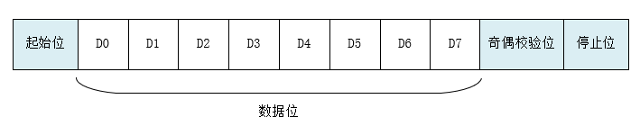

9、驱动框架与适配
=================

RT-Thread

UART 驱动
---------

UART 简介
~~~~~~~~~

UART（Universal Asynchronous
Receiver/Transmitter）通用异步收发传输器，UART
作为异步串口通信协议的一种，工作原理是将传输数据的每个字符一位接一位地传输。是在应用程序开发过程中使用频率最高的数据总线。

UART 串口的特点是将数据一位一位地顺序传送，只要 2
根传输线就可以实现双向通信，一根线发送数据的同时用另一根线接收数据。UART
串口通信有几个重要的参数，分别是波特率、起始位、数据位、停止位和奇偶检验位，对于两个使用
UART 串口通信的端口，这些参数必须匹配，否则通信将无法正常完成。UART
串口传输的数据格式如下图所示：

   uart

起始位：表示数据传输的开始，电平逻辑为 “0” 。

数据位：可能值有 5、6、7、8、9，表示传输这几个 bit 位数据。一般取值为
8，因为一个 ASCII 字符值为 8 位。

奇偶校验位：用于接收方对接收到的数据进行校验，校验 “1”
的位数为偶数(偶校验)或奇数(奇校验)，以此来校验数据传送的正确性，使用时不需要此位也可以。

停止位： 表示一帧数据的结束。电平逻辑为 “1”。

波特率：串口通信时的速率，它用单位时间内传输的二进制代码的有效位(bit)数来表示，其单位为每秒比特数
bit/s(bps)。常见的波特率值有
4800、9600、14400、38400、115200等，数值越大数据传输的越快，波特率为
115200 表示每秒钟传输 115200 位数据。

驱动适配
~~~~~~~~

CV1800B 串口驱动代码位于
``bsp/cvitek/drivers/drv_uart.c``\ ，大核和小核共用该串口驱动。需要特别注意的是大核和小核对应的中断号是不同的，中断号可通过
https://github.com/milkv-duo/duo-files/blob/main/duo/datasheet/CV180X-Interrupt-v1.xlsx
获取。

初始化
^^^^^^

初始化在 ``rt_hw_uart_init()`` 函数中完成以下工作： 1. 初始化对应串口
GPIO 2. 调用 ``rt_hw_serial_register()`` 注册串口设备信息，将结构体
``struct rt_uart_ops`` 变量 \_uart_ops 的指针作为传输传入 3. 调用
``rt_hw_interrupt_install()`` 注册串口接收中断

``rt_hw_uart_init()`` 函数需要在 ``rt_hw_board_init()`` 中显示调用。

.. code:: c

   #include <rthw.h>
   #include <rtthread.h>
   #include <rtdevice.h>

   #include "board.h"
   #include "drv_uart.h"

   #define DBG_TAG "DRV.UART"
   #define DBG_LVL DBG_WARNING
   #include <rtdbg.h>

   /*
    * Divide positive or negative dividend by positive divisor and round
    * to closest integer. Result is undefined for negative divisors and
    * for negative dividends if the divisor variable type is unsigned.
    */
   #define DIV_ROUND_CLOSEST(x, divisor)(          \
   {                           \
       typeof(x) __x = x;              \
       typeof(divisor) __d = divisor;          \
       (((typeof(x))-1) > 0 ||             \
        ((typeof(divisor))-1) > 0 || (__x) > 0) ?  \
           (((__x) + ((__d) / 2)) / (__d)) :   \
           (((__x) - ((__d) / 2)) / (__d));    \
   }                           \
   )

   #define BOTH_EMPTY (UART_LSR_TEMT | UART_LSR_THRE)

   struct hw_uart_device
   {
       rt_ubase_t hw_base;
       rt_uint32_t irqno;
   };

   #define BSP_DEFINE_UART_DEVICE(no)                  \
   static struct hw_uart_device _uart##no##_device =   \
   {                                                   \
       UART##no##_BASE,                           \
       UART##no##_IRQ                                  \
   };                                                  \
   static struct rt_serial_device _serial##no;

   #ifdef RT_USING_UART0
   BSP_DEFINE_UART_DEVICE(0);
   #endif

   #ifdef RT_USING_UART1
   BSP_DEFINE_UART_DEVICE(1);
   #endif

   #ifdef RT_USING_UART2
   BSP_DEFINE_UART_DEVICE(2);
   #endif

   #ifdef RT_USING_UART3
   BSP_DEFINE_UART_DEVICE(3);
   #endif

   int rt_hw_uart_init(void)
   {
       struct hw_uart_device* uart;
       struct serial_configure config = RT_SERIAL_CONFIG_DEFAULT;

       config.baud_rate = 115200;

   #define BSP_INSTALL_UART_DEVICE(no)     \
       uart = &_uart##no##_device;         \
       _serial##no.ops    = &_uart_ops;    \
       _serial##no.config = config;        \
       rt_hw_serial_register(&_serial##no, "uart" #no, RT_DEVICE_FLAG_RDWR | RT_DEVICE_FLAG_INT_RX, uart); \
       rt_hw_interrupt_install(uart->irqno, rt_hw_uart_isr, &_serial##no, "uart" #no);

   #ifdef RT_USING_UART0
       PINMUX_CONFIG(UART0_RX, UART0_RX);
       PINMUX_CONFIG(UART0_TX, UART0_TX);
       BSP_INSTALL_UART_DEVICE(0);
   #endif

   #ifdef RT_USING_UART1
       PINMUX_CONFIG(IIC0_SDA, UART1_RX);
       PINMUX_CONFIG(IIC0_SCL, UART1_TX);
       BSP_INSTALL_UART_DEVICE(1);
   #endif

   #ifdef RT_USING_UART2
       PINMUX_CONFIG(SD1_D1, UART2_RX);
       PINMUX_CONFIG(SD1_D2, UART2_TX);
       BSP_INSTALL_UART_DEVICE(2);
   #endif

   #ifdef RT_USING_UART3
       PINMUX_CONFIG(SD1_D1, UART3_RX);
       PINMUX_CONFIG(SD1_D2, UART3_TX);
       BSP_INSTALL_UART_DEVICE(3);
   #endif

   #ifdef RT_USING_UART4
       PINMUX_CONFIG(SD1_GP0, UART4_RX);
       PINMUX_CONFIG(SD1_GP1, UART4_TX);
       BSP_INSTALL_UART_DEVICE(4);
   #endif

       return 0;
   }

struct rt_uart_ops 结构体
~~~~~~~~~~~~~~~~~~~~~~~~~

结构体 ``struct rt_uart_ops`` 对应 4 个 函数：

1. configure：配置串口传输数据格式，包括数据位、停止位、奇偶校验位、波特率等。
2. control：完成串口中断开启、中断关闭。
3. putc：发送 1 个字符。
4. getc：接收 1 个字符。该函数会在中断触发后，RT-Thread
   串口驱动框架自动调用。

.. code:: c

   rt_inline rt_uint32_t dw8250_read32(rt_ubase_t addr, rt_ubase_t offset)
   {
       return *((volatile rt_uint32_t *)(addr + (offset << UART_REG_SHIFT)));
   }

   rt_inline void dw8250_write32(rt_ubase_t addr, rt_ubase_t offset, rt_uint32_t value)
   {
       *((volatile rt_uint32_t *)(addr + (offset << UART_REG_SHIFT))) = value;

       if (offset == UART_LCR)
       {
           int tries = 1000;

           /* Make sure LCR write wasn't ignored */
           while (tries--)
           {
               unsigned int lcr = dw8250_read32(addr, UART_LCR);

               if ((value & ~UART_LCR_STKP) == (lcr & ~UART_LCR_STKP))
               {
                   return;
               }

               dw8250_write32(addr, UART_FCR, UART_FCR_DEFVAL);
               dw8250_read32(addr, UART_RX);

               *((volatile rt_uint32_t *)(addr + (offset << UART_REG_SHIFT))) = value;
           }
       }
   }

   static void dw8250_uart_setbrg(rt_ubase_t addr, int baud_divisor)
   {
       /* to keep serial format, read lcr before writing BKSE */
       int lcr_val = dw8250_read32(addr, UART_LCR) & ~UART_LCR_BKSE;

       dw8250_write32(addr, UART_LCR, UART_LCR_BKSE | lcr_val);
       dw8250_write32(addr, UART_DLL, baud_divisor & 0xff);

       dw8250_write32(addr, UART_DLM, (baud_divisor >> 8) & 0xff);
       dw8250_write32(addr, UART_LCR, lcr_val);
   }

   static rt_err_t dw8250_uart_configure(struct rt_serial_device *serial, struct serial_configure *cfg)
   {
       rt_base_t base;
       struct hw_uart_device *uart;
       int clock_divisor;

       RT_ASSERT(serial != RT_NULL);
       uart = (struct hw_uart_device *)serial->parent.user_data;
       base = uart->hw_base;

       while (!(dw8250_read32(base, UART_LSR) & UART_LSR_TEMT));

       dw8250_write32(base, UART_IER, 0);
       dw8250_write32(base, UART_MCR, UART_MCRVAL);
       dw8250_write32(base, UART_FCR, UART_FCR_DEFVAL);

       /* initialize serial config to 8N1 before writing baudrate */
       dw8250_write32(base, UART_LCR, UART_LCR_8N1);

       clock_divisor = DIV_ROUND_CLOSEST(UART_INPUT_CLK, 16 * serial->config.baud_rate);
       dw8250_uart_setbrg(base, clock_divisor);

       return RT_EOK;
   }

   static rt_err_t dw8250_uart_control(struct rt_serial_device *serial, int cmd, void *arg)
   {
       struct hw_uart_device *uart;

       RT_ASSERT(serial != RT_NULL);
       uart = (struct hw_uart_device *)serial->parent.user_data;

       switch (cmd)
       {
           case RT_DEVICE_CTRL_CLR_INT:
               /* Disable rx irq */
               dw8250_write32(uart->hw_base, UART_IER, !UART_IER_RDI);
               rt_hw_interrupt_mask(uart->irqno);
               break;

           case RT_DEVICE_CTRL_SET_INT:
               /* Enable rx irq */
               dw8250_write32(uart->hw_base, UART_IER, UART_IER_RDI);
               rt_hw_interrupt_umask(uart->irqno);
               break;
       }

       return RT_EOK;
   }

   static int dw8250_uart_putc(struct rt_serial_device *serial, char c)
   {
       rt_base_t base;
       struct hw_uart_device *uart;

       RT_ASSERT(serial != RT_NULL);
       uart = (struct hw_uart_device *)serial->parent.user_data;
       base = uart->hw_base;

       while ((dw8250_read32(base, UART_LSR) & BOTH_EMPTY) != BOTH_EMPTY);

       dw8250_write32(base, UART_TX, c);

       return 1;
   }

   static int dw8250_uart_getc(struct rt_serial_device *serial)
   {
       int ch = -1;
       rt_base_t base;
       struct hw_uart_device *uart;

       RT_ASSERT(serial != RT_NULL);
       uart = (struct hw_uart_device *)serial->parent.user_data;
       base = uart->hw_base;

       if (dw8250_read32(base, UART_LSR) & UART_LSR_DR)
       {
           ch = dw8250_read32(base, UART_RX) & 0xff;
       }

       return ch;
   }

   static const struct rt_uart_ops _uart_ops =
   {
       dw8250_uart_configure,
       dw8250_uart_control,
       dw8250_uart_putc,
       dw8250_uart_getc,
   };

中断处理
^^^^^^^^

串口中断处理函数在串口初始化时，已经注册到系统的中断处理函数中。通过读取中断状态寄存器，判断是哪个串口的中断，然后调用
``rt_hw_serial_isr()`` 函数将中断状态通知 RT-Thread
串口驱动框架。串口驱动框架会调用上面提到的 ``getc()``
函数读取串口数据，直至返回 -1。

.. code:: c

   static void rt_hw_uart_isr(int irqno, void *param)
   {
       unsigned int iir, status;
       struct rt_serial_device *serial = (struct rt_serial_device *)param;
       struct hw_uart_device *uart = (struct hw_uart_device *)serial->parent.user_data;

       iir = dw8250_read32(uart->hw_base, UART_IIR);

       /* If don't do this in non-DMA mode then the "RX TIMEOUT" interrupt will fire forever. */
       if ((iir & 0x3f) == UART_IIR_RX_TIMEOUT)
       {
           status = dw8250_read32(uart->hw_base, UART_LSR);

           if (!(status & (UART_LSR_DR | UART_LSR_BI)))
           {
               dw8250_read32(uart->hw_base, UART_RX);
           }
       }

       if (!(iir & UART_IIR_NO_INT))
       {
           rt_hw_serial_isr(serial, RT_SERIAL_EVENT_RX_IND);
       }

       if ((iir & UART_IIR_BUSY) == UART_IIR_BUSY)
       {
           /* Clear the USR */
           dw8250_read32(uart->hw_base, UART_USR);

           return;
       }
   }

完成串口驱动适配后，即可正常使用 RT-Thread 的命令行工具 msh 了。
